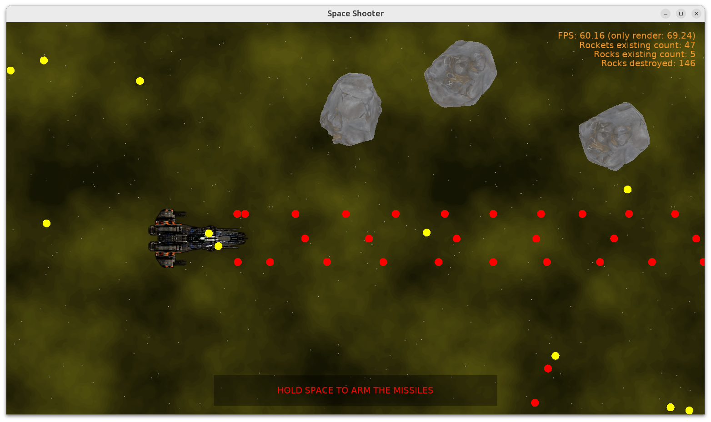

# Space Shooter

Initial version of a space shooter game.

- Space ship (click anywhere on the screen, or use arrows, to move it).

- Background (drawn efficiently as one quad, with texture repeating to infinity).

- Rockets (fired by the player's cannons). Each rocket has a collider and can detect when it hit an enemy. Rocket can be "armed" (destroys enemies) or "not" (just a ball that bounces off enemies).

- Enemies, played by the Mighty Rotating Rocks! They just move slowly towards the player. You can shoot them to destroy.

- Explosions played when rocket hits an enemy.

Technically:

- The player is just a `TCastleScene` inside a `TCastleViewport`, with input events handled in `TViewMain`.
- Using `TCastleComponentFactory` to create rockets and rocks. Each of them is defined by a [reusable design](https://castle-engine.io/reuse_design).
- Using [behaviors](https://castle-engine.io/behaviors) to define various behaviors of rocks and rockets.
- Using [physics](https://castle-engine.io/physics) to handle collisions between rockets and rocks.
- Special component `TTilingBackground` to draw a background that (seems to) repeat to infinity.

Using [Castle Game Engine](https://castle-engine.io/).

## Building

Compile by:

- [CGE editor](https://castle-engine.io/editor). Just use menu items _"Compile"_ or _"Compile And Run"_.

- Or use [CGE command-line build tool](https://castle-engine.io/build_tool). Run `castle-engine compile` in this directory.

- Or use [Lazarus](https://www.lazarus-ide.org/). Open in Lazarus `space_shooter_standalone.lpi` file and compile / run from Lazarus. Make sure to first register [CGE Lazarus packages](https://castle-engine.io/lazarus).

- Or use [Delphi](https://www.embarcadero.com/products/Delphi). Open in Delphi `space_shooter_standalone.dproj` file and compile / run from Delphi. See [CGE and Delphi](https://castle-engine.io/delphi) documentation for details.