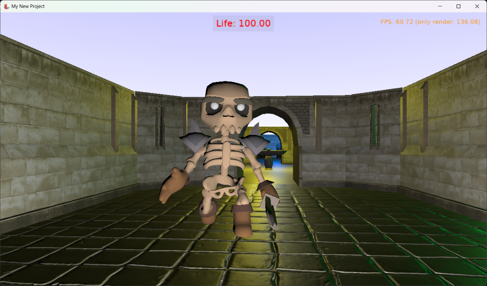
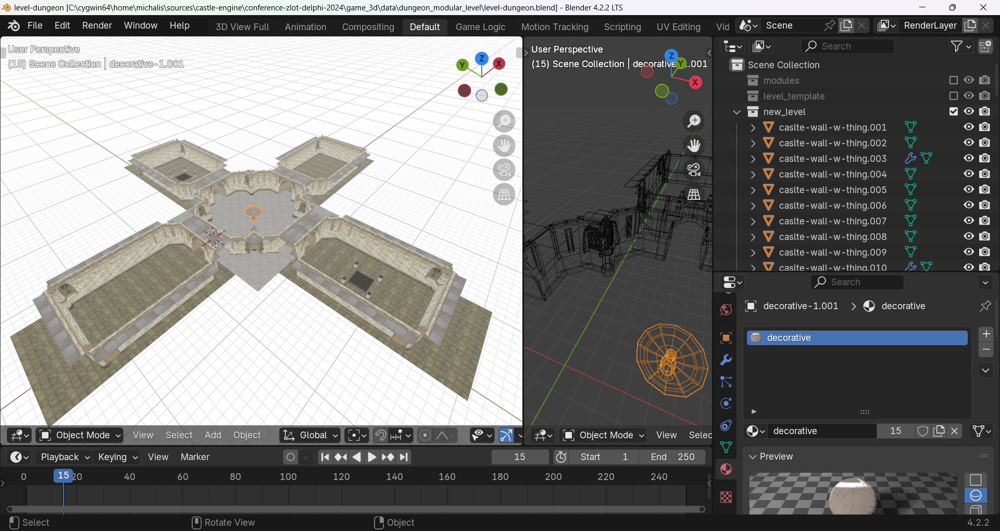
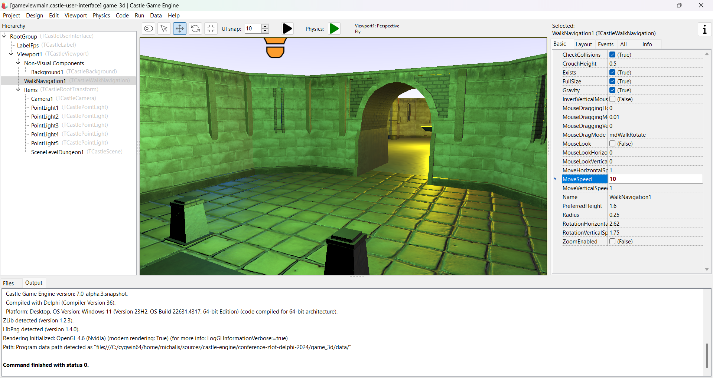
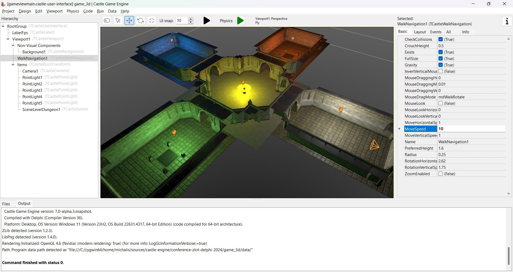
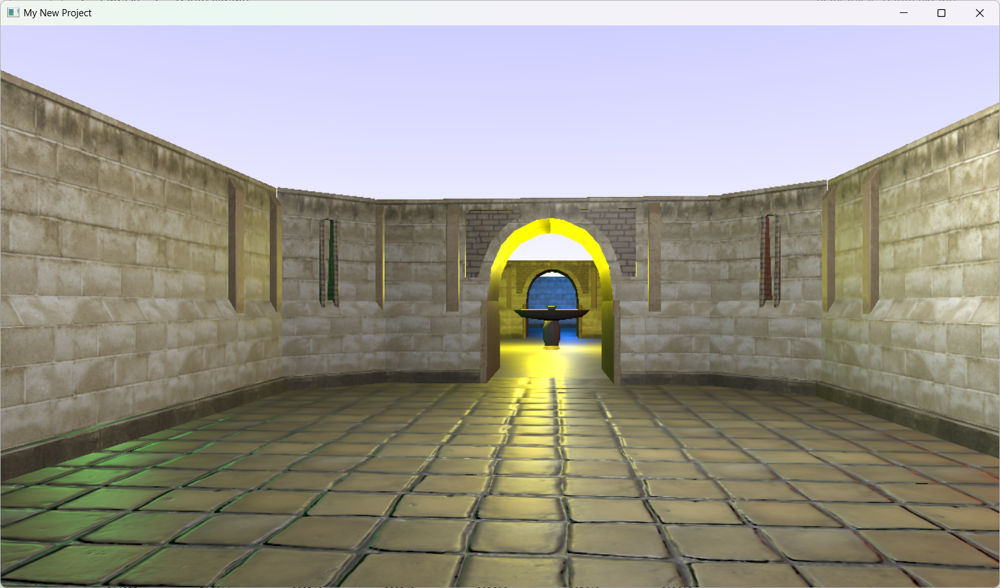
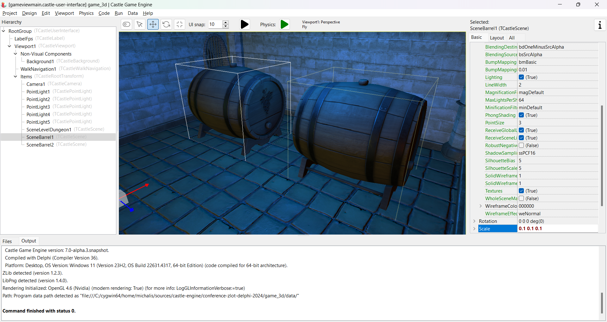
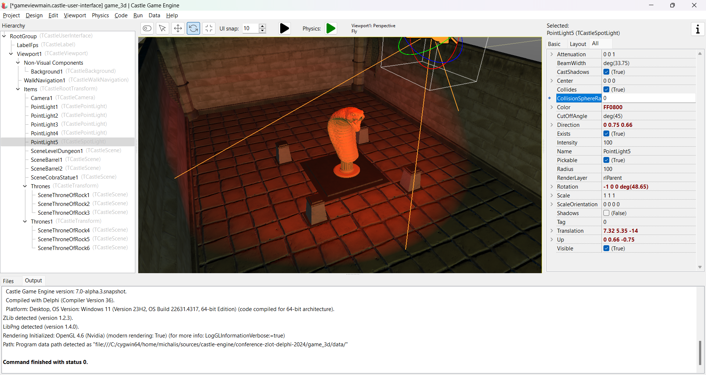
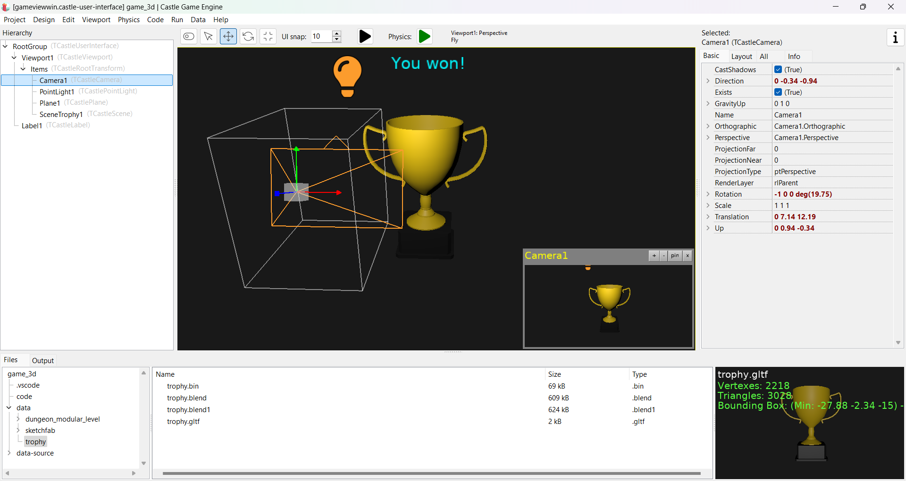

# Fight skeletons, explore dungeons

## Introduction

FPS game where you shoot at skeletons and try to find dungeons exit. Enemy logic is configured using our TCastleMoveAttack.

## Features

This demonstrates creating a simple 3D FPS game, from start to finish. The level, creatures, and win/lose views have been done using:

- [Castle Game Engine editor](https://castle-engine.io/editor)

- [Blender](https://castle-engine.io/blender) (to design base level geometry)

- [Sketchfab](https://castle-engine.io/sketchfab) (to add additional props to the level)

- [Quaternius models](https://quaternius.com/) (to add animated enemies)

- [TCastleMoveAttack component](https://castle-engine.io/apidoc/html/CastleLivingBehaviors.TCastleMoveAttack.html) (for ready logic of moving enemies and player hit points),

- `TCastleWalkNavigation` (for ready handling of AWSD and similar keys, typical for FPS games).

Controls:

- Walk using AWSD keys,
- rotate by holding _right mouse button_ and moving the mouse,
- shoot by clicking with _left mouse button_.

The Pascal code (most in `GameViewMain` unit) adds logic to

- Activate _mouse look_ when right mouse button is pressed,

- Show "game win" view when player reaches a certain place in the level,

- Show "game over (lost)" view when player life drops to zero,

- Show player life (hit points),

- Shoot enemy on mouse click.

Do you want to see something more?

- Follow [Castle Game Engine](https://castle-engine.io/) tutorials and manual.

- See other examples included in the engine, like [examples/creature_behaviors](https://github.com/castle-engine/castle-engine/tree/master/examples/creature_behaviors) that show other features, e.g. how to visualize getting hit by "temporary fade to red".

## Screenshots

## 3D assets credits and licenses

Using [Castle Game Engine](https://castle-engine.io/).

- Dungeon based on https://opengameart.org/content/3d-castle-dungeon-tileset-extended nby [rubberduck](https://opengameart.org/users/rubberduck)

    This is in turn using other assets, see `data-source/original_dungeon-tileset-extended/readme.txt` for details.

- Trophy from https://opengameart.org/content/trophy by [JeremyWoods](https://opengameart.org/users/jeremywoods) (license: CC0).

- Multiple [Sketchfab](https://sketchfab.com/features/gltf) models, see `data/sketchfab` for details and links to authors. Licenses are a mix of _Creative Commons Attribution_ and _Creative Commons Attribution NonCommercial_ licenses.

- Skeleton from [Quaternius Pirate Kit](https://quaternius.com/packs/piratekit.html), CC0.

## History

This was made as demo project for presentation at [Zlot Programistów Delphi 2024](https://www.bsc.com.pl/zlot-programistow-delphi-2024/).

Slides (in Polish): https://castle-engine.io/zlot2024 .

## Building

Compile by:

- [CGE editor](https://castle-engine.io/editor). Just use menu items _"Compile"_ or _"Compile And Run"_.

- Or use [CGE command-line build tool](https://castle-engine.io/build_tool). Run `castle-engine compile` in this directory.

- Or use [Lazarus](https://www.lazarus-ide.org/). Open in Lazarus `game_3d_standalone.lpi` file and compile / run from Lazarus. Make sure to first register [CGE Lazarus packages](https://castle-engine.io/lazarus).

- Or use [Delphi](https://www.embarcadero.com/products/Delphi). Open in Delphi `game_3d_standalone.dproj` file and compile / run from Delphi. See [CGE and Delphi](https://castle-engine.io/delphi) documentation for details.