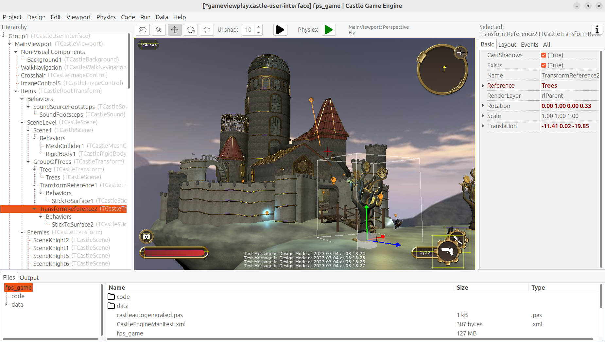
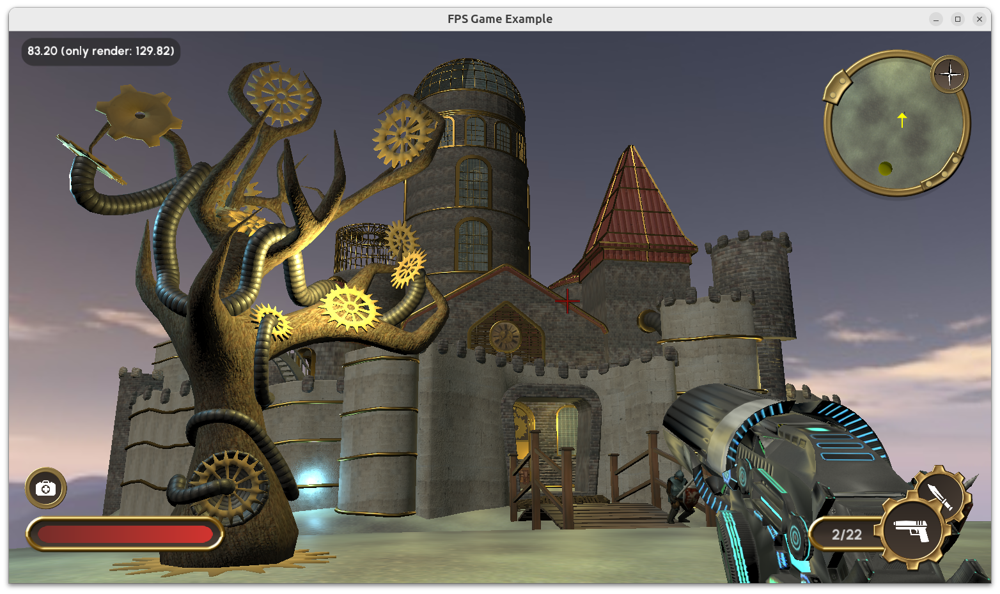
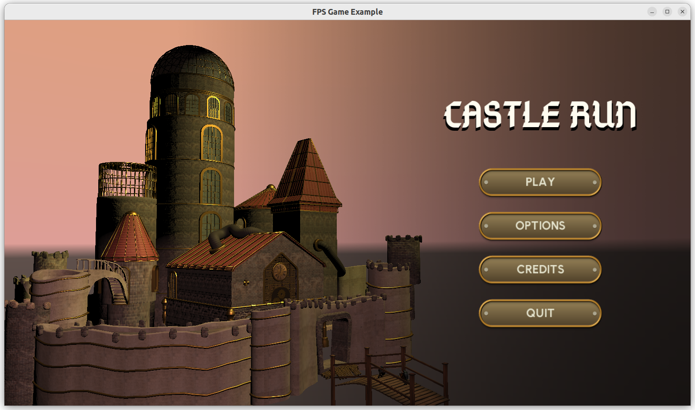

# Explore Impressive 3D Castle

- Walk in 3D exploring an impressive 3D castle.

    - Castle graphics custom made by real graphic artists (thank you to [Adrianna Matejek](https://github.com/Sherchloex) and [Alya Vaneskehyan](https://github.com/AlyaVanes)) for our engine. Put together using [Blender](https://castle-engine.io/blender) and [Castle Game Engine Editor](https://castle-engine.io/editor).

- Shoot at enemies.

  - Right now, only one knight guards the entrance.

  - The enemy logic is using [TCastleMoveAttack component](https://castle-engine.io/apidoc/html/CastleLivingBehaviors.TCastleMoveAttack.html).

- Full game controller support (joystick, gamepad) using trivial [TCastleWalkNavigation.UseGameController](https://castle-engine.io/apidoc/html/CastleCameras.TCastleWalkNavigation.html#UseGameController-Integer-).

    - See [documentation about implementing controller support](https://castle-engine.io/controllers) in our engine.

- An extra viewport in right-top corner of the screen shows a mini-map (view from the top). See [Multiple viewports to display one world](https://castle-engine.io/multiple_viewports_to_display_one_world) for a documentation how to set this up.

## Screenshots

## Inputs

Attack (with currently equipped weapon) by clicking with left mouse button.

Move and rotate:

- use AWSD or arrow keys,
- look around using _"Mouse Look"_ (move the mouse when in game),
- hold Shift to run.

Misc:

- screenshot: F5.
- fake win: P,
- fake death: O.

Game controller inputs are documented at [TCastleWalkNavigation.UseGameController](https://castle-engine.io/apidoc/html/CastleCameras.TCastleWalkNavigation.html#UseGameController-Integer-).

A lot more keys and mouse shortcuts are instantly working
(and they all are configurable, too). See the [TCastleWalkNavigation](https://castle-engine.io/apidoc/html/CastleCameras.TCastleWalkNavigation.html) features.

## Building

Using [Castle Game Engine](https://castle-engine.io/).

Compile by:

- [CGE editor](https://castle-engine.io/editor). Just use menu items _"Compile"_ or _"Compile And Run"_.

- Or use [CGE command-line build tool](https://castle-engine.io/build_tool). Run `castle-engine compile` in this directory.

- Or use [Lazarus](https://www.lazarus-ide.org/). Open in Lazarus `fps_game.lpi` file and compile / run from Lazarus. Make sure to first register [CGE Lazarus packages](https://castle-engine.io/lazarus).

- Or use [Delphi](https://www.embarcadero.com/products/Delphi). Open in Delphi `fps_game.dproj` file and compile / run from Delphi. See [CGE and Delphi](https://castle-engine.io/delphi) documentation for details.
