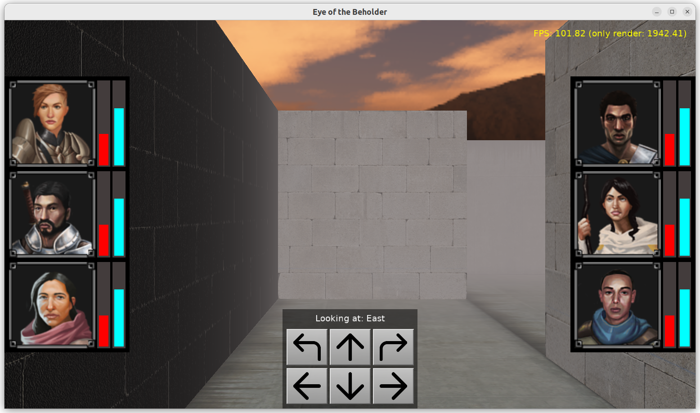

# Eye of the Beholder

Demo of a game like "Eye of the Beholder":

- First-person view

- Movement on a grid (AWSD keys)
    - walking in a labirynth designed in Blender
    - we prevent walking if we detect collision between current and target position

- Rotations by 90 degrees (QE keys)

- 6 buttons to perform movement and rotation, to be able to move/rotate using mouse (or touch on mobile)

- Label shows current view direction

- UI with stats for a band of 6 heroes (not functional, just a demo)

Compare this with real "Eye of the Beholder" UI on https://thekingofgrabs.files.wordpress.com/2019/05/eye-of-the-beholder-3-pc-084.png :)

Using [Castle Game Engine](https://castle-engine.io/).

## Building

Compile by:

- [CGE editor](https://castle-engine.io/editor). Just use menu items _"Compile"_ or _"Compile And Run"_.

- Or use [CGE command-line build tool](https://castle-engine.io/build_tool). Run `castle-engine compile` in this directory.

- Or use [Lazarus](https://www.lazarus-ide.org/). Open in Lazarus `eye_of_beholder_standalone.lpi` file and compile / run from Lazarus. Make sure to first register [CGE Lazarus packages](https://castle-engine.io/lazarus).

- Or use [Delphi](https://www.embarcadero.com/products/Delphi). Open in Delphi `eye_of_beholder_standalone.dproj` file and compile / run from Delphi. See [CGE and Delphi](https://castle-engine.io/delphi) documentation for details.
