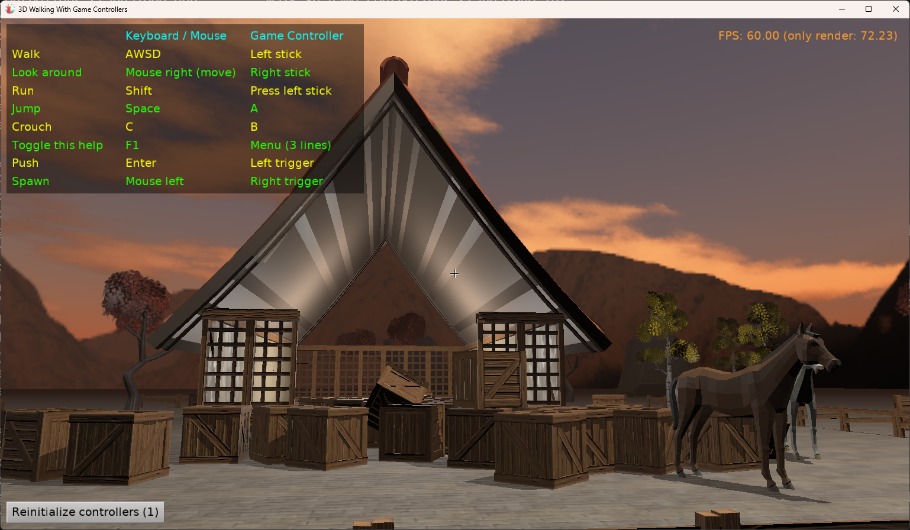
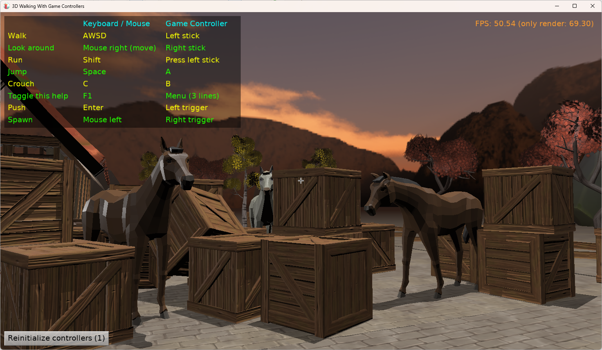
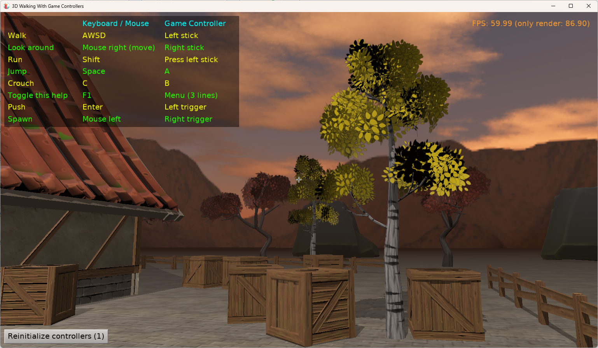

# Walking Talking Adventure, With Full Game Controller Support

Simple 3D game where you can

- walk

- spawn and push physical objects

- interact with things

- talk with NPCs, like horses :)

- All with full game controller support (joystick, gamepad).

Using [Castle Game Engine](https://castle-engine.io/).

## Authors

This demo (code, and arrangement of data using [Blender](https://castle-engine.io/blender) and [Castle Game Engine editor](https://castle-engine.io/editor)) was made by [Michalis Kamburelis](https://michalis.xyz/).

We used numerous 3D assets by [Quaternius](https://quaternius.com/), a great source of public-domain high-quality 3D models. Visit [Quaternius homepage for more stuff](https://quaternius.com/) and [support him on Patreon](https://www.patreon.com/quaternius) if you can.

## Building

Compile by:

- [CGE editor](https://castle-engine.io/editor). Just use menu items _"Compile"_ or _"Compile And Run"_.

- Or use [CGE command-line build tool](https://castle-engine.io/build_tool). Run `castle-engine compile` in this directory.

- Or use [Lazarus](https://www.lazarus-ide.org/). Open in Lazarus `walk_3d_game_controllers_standalone.lpi` file and compile / run from Lazarus. Make sure to first register [CGE Lazarus packages](https://castle-engine.io/lazarus).

- Or use [Delphi](https://www.embarcadero.com/products/Delphi). Open in Delphi `walk_3d_game_controllers_standalone.dproj` file and compile / run from Delphi. See [CGE and Delphi](https://castle-engine.io/delphi) documentation for details.