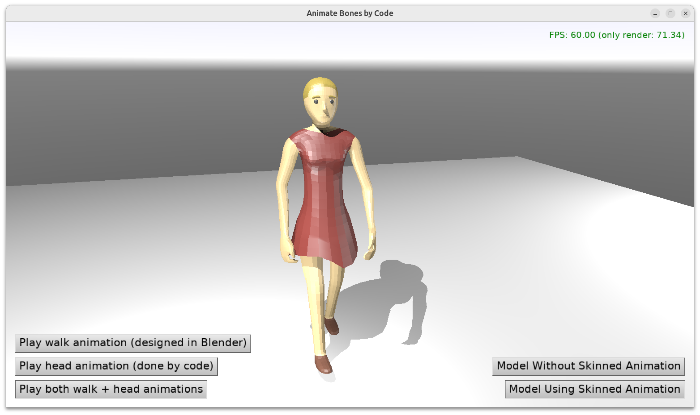

# Animate Bones by Code

## Overview

Demo that you can access and animate from code joints (bones) of a 3D model.

Works both with:

- skinned animation (Blender's armature/bones) and

- non-skinned animation (Blender's regular objects in a hierarchy, animate their translation/rotation/scale).

That is, you can:

1. Design a model in Blender, with animations designed in Blender, and export it to glTF (see https://castle-engine.io/blender and https://castle-engine.io/gltf ). Then load as one `TCastleScene`.

    _Castle Game Engine_ will load the transformations, including bones (joints), to `TTransformNode` instances and the designed skin (if any) to `TSkinNode` instance. See https://castle-engine.io/skin about the skin node.

2. From code, you can access particular transformation like `LeftArm := MyScene.Node('LeftArm') as TTransformNode` and transform it using e.g. `LeftArm.Rotation := ...`.



## Designing animation

### With skinning

You can use Blender armature/bones. Export from Blender to glTF, and the glTF model will automatically use skinned animation.

We handle such animation using [Skin node](https://castle-engine.io/skin) in _Castle Game Engine_. Modifying the bones from code will affect the skinned mesh naturally.

Remember that your animation, as exported to glTF, has to _not_ touch the `Neck` joint, since we want to be able to transform `Neck` by Pascal code. Trying to animate the `Neck` joint following both Blender animation (realized by our engine automatically in `TCastleScene`) and your own code would not make sense -- 2 things would try to change the same joint transformation, last modification (usually the one in `TCastleScene`, though it depends on where do you insert Pascal code that modifies `Neck`) wins.

You can tweak Blender->glTF settings to avoid storing any transformation for `Neck`, or just use our engine to "disconnect" the animation from touching the `Neck`. This example shows how to do the latter, by execcuting `RemoveAnimationsAffectingJoint`. Feel free to reuse `RemoveAnimationsAffectingJoint` in your own projects.

### Without skinning

- Use regular Blender objects organized using Blender parent-child hierarchy (Ctrl+P in Blender).

    If you want to animate them in Blender too (to mix animations created in Blender and by code -- because you can) then set keyframes on objects' location/rotation in Blender. To have multiple Blender actions (e.g. rotations of different transformations) exported to one single glTF animation (like `walk` in this example) just push all actions to 1 _"NLA track"_ with the same name in Blender (`walk` in this case). The Blender->glTF exporter has a checkbox _"Group by NLA Track"_ (_"on"_ by default) to deal with this setup.

- You should set proper transformation hierarchy in Blender. For each Blender object, assign a parent to it by Ctrl+P. Advised: set also a useful name for Blender object (it will be reflected in glTF and then in `TTransformNode` name). To confirm this is set correctly, this demo application writes to log a raport of your transformations, it should look like this:

    ```
    Found node: Torso, parent: (unnamed)
    Found node: ArmHinge.L, parent: Torso
    Found node: Arm.L, parent: ArmHinge.L
    Found node: Elbow.L, parent: Arm.L
    Found node: Forearm.L, parent: Elbow.L
    Found node: ArmHinge.R, parent: Torso
    Found node: Arm.R, parent: ArmHinge.R
    Found node: Elbow.R, parent: Arm.R
    Found node: Forearm.R, parent: Elbow.R
    Found node: LegHinge.L, parent: Torso
    Found node: Thigh.L, parent: LegHinge.L
    Found node: Knee.L, parent: Thigh.L
    Found node: Calf.L, parent: Knee.L
    Found node: LegHinge.R, parent: Torso
    Found node: Thigh.R, parent: LegHinge.R
    Found node: Knee.R, parent: Thigh.R
    Found node: Calf.R, parent: Knee.R
    Found node: Neck, parent: Torso
    Found node: Head, parent: Neck
    ```

### Notes of changing bone (joint) by code

- You should not transform (from code) a bone that is also being animated (e.g. using `MyScene.PlayAnimation` or `MyScene.AutoAnimation`). Transformation of such bone will be overridden by animation at each frame.

- But you *can* transform (from code) a bone that is not being touched by the current animation.

- To make it easy to set hardcoded values, we advise to keep rotations and scale set at "identity" in Blender (you can select all objects in Blender and use Ctrl+A to "Apply" rotation and scale).

- You can test what happens in Blender when you animate given transformation with "Local" pivot. This is what your code will be doing too, so make sure in Blender that it works as you expect.

### TODO: enable testing this using TCastleSceneCore.ExposeTransform

- In the future, it should also be possible to animate bones exposed using `TCastleSceneCore.ExposeTransform`. Instead of accessing `TTransformNode` you would then access `TCastleTransform`. This will have a few advantages:

    - You can see the bones, exposed using `TCastleSceneCore.ExposeTransform`, in CGE editor. You can transform them in CGE editor too. So it will be more obvious what's going on, as it will testable using CGE editor.

    - You can attach behaviors to any `TCastleTransform` (so, also to bones exposed using `TCastleSceneCore.ExposeTransform`). E.g. you will be able to attach a physics rigid body and joint to a particular bone.

    - This will work both for bones to which a rigid object is attached, as well as for bones to which a skinned mesh is attached. Whether you animate `TTransformNode` or exposed bone from `TCastleSceneCore.ExposeTransform`, it will work the same.

## Building

Using [Castle Game Engine](https://castle-engine.io/).

Compile by:

- [CGE editor](https://castle-engine.io/editor). Just use menu items _"Compile"_ or _"Compile And Run"_.

- Or use [CGE command-line build tool](https://castle-engine.io/build_tool). Run `castle-engine compile` in this directory.

- Or use [Lazarus](https://www.lazarus-ide.org/). Open in Lazarus `animate_bones_by_code_standalone.lpi` file and compile / run from Lazarus. Make sure to first register [CGE Lazarus packages](https://castle-engine.io/lazarus).

- Or use [Delphi](https://www.embarcadero.com/products/Delphi). Open in Delphi `animate_bones_by_code_standalone.dproj` file and compile / run from Delphi. See [CGE and Delphi](https://castle-engine.io/delphi) documentation for details.
