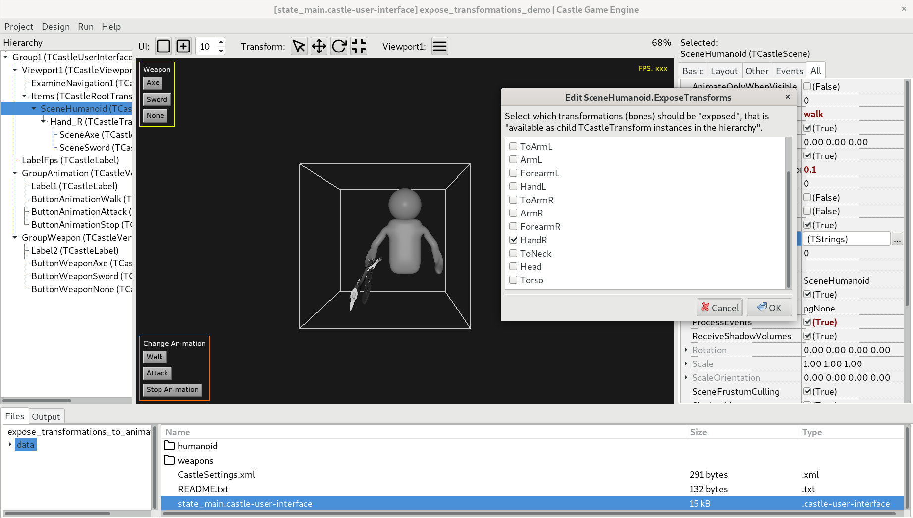

# Demo of TCastleSceneCore.ExposeTransforms

See [Expose scene elements, like children transformations as TCastleScene children](https://castle-engine.io/expose) documentation and `TCastleSceneCore.ExposeTransforms` API docs.

This feature allows to:

- Expose a "transformation" (usually a bone of an animated model) from a model loaded to TCastleScene.

  For example, you can load `humanoid.gltf` bone and expose a bone called `Hand_R` (right hand).

- _Exposing_ means that the bone corresponds to a child `TCastleTransform` which is synchronized with the bone (thus, it will be animated with the bone).

  In this example, it means that you get a `TCastleTransform` instance named `Hand_R` inside the viewport.

- In effect, you can attach stuff to the bone (e.g. attaching weapons to hand) in a natural way, just by creating children TCastleScene instances.

  In this example, we attach an axe or a sword to the hand. They are both defined by separate glTF files.

The `TCastleSceneCore.ExposeTransforms` can be configured in the CGE editor, the whole construction is friendly to visual editing.

Using [Castle Game Engine](https://castle-engine.io/).

## Building

Compile by:

- [CGE editor](https://castle-engine.io/editor). Just use menu items _"Compile"_ or _"Compile And Run"_.

- Or use [CGE command-line build tool](https://castle-engine.io/build_tool). Run `castle-engine compile` in this directory.

- Or use [Lazarus](https://www.lazarus-ide.org/). Open in Lazarus `expose_transformations_demo_standalone.lpi` file and compile / run from Lazarus. Make sure to first register [CGE Lazarus packages](https://castle-engine.io/lazarus).

- Or use [Delphi](https://www.embarcadero.com/products/Delphi). Open in Delphi `expose_transformations_demo_standalone.dproj` file and compile / run from Delphi. See [CGE and Delphi](https://castle-engine.io/delphi) documentation for details.
