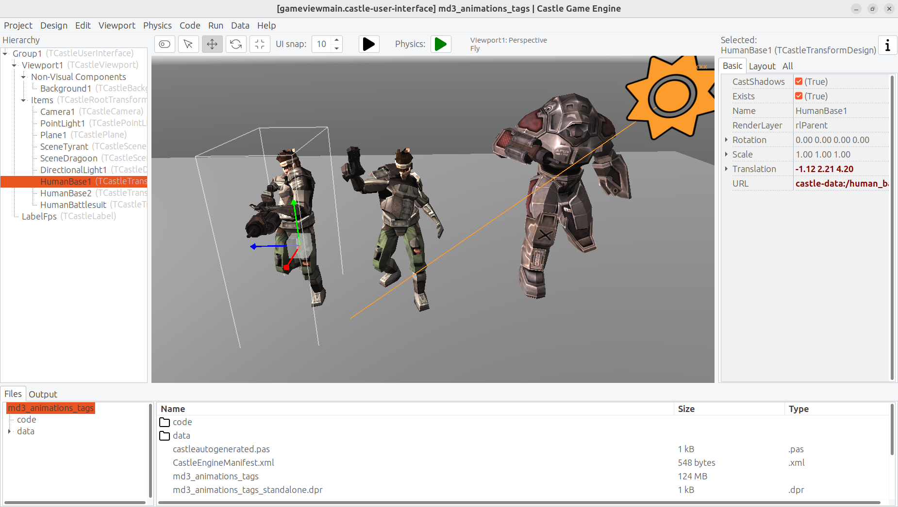

# MD3 animations and tags

Using MD3 models with some animations and tags. See https://castle-engine.io/creating_data_model_formats.php#section_md3 .

Using [Castle Game Engine](https://castle-engine.io/).

## Building

Compile by:

- [CGE editor](https://castle-engine.io/manual_editor.php). Just use menu item _"Compile"_.

- Or use [CGE command-line build tool](https://castle-engine.io/build_tool). Run `castle-engine compile` in this directory.

- Or use [Lazarus](https://www.lazarus-ide.org/). Open in Lazarus `md3_animations_tags_standalone.lpi` file and compile / run from Lazarus. Make sure to first register [CGE Lazarus packages](https://castle-engine.io/documentation.php).
