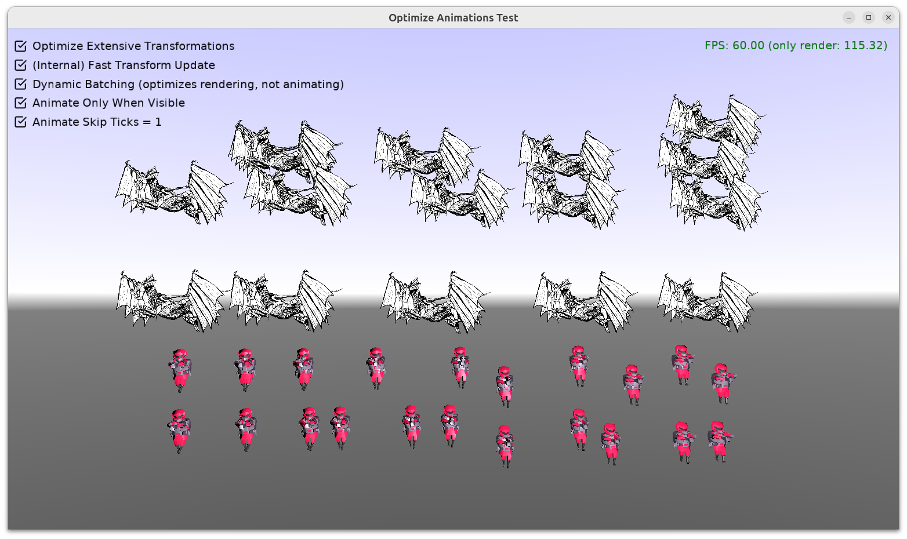

# Optimize Animations Test

Test various _Castle Game Engine_ options that optimize animations processing.

To experiment with the performance, make sure to make a _release_ (not _debug_) build.

The options demonstrated here are:

- [OptimizeExtensiveTransformations](https://castle-engine.io/apidoc/html/CastleSceneCore.html#InternalFastTransformUpdate)

    Optimize animated transformation hierarchies when many transformations change every frame. Like typical animations done using skeleton, in Spine or glTF.

    TODO: In the future, I hope to be able to remove this flag, and the respective gain should be automatic in the engine. See [roadmap](https://castle-engine.io/roadmap#animations_optimized).

- [InternalFastTransformUpdate](https://castle-engine.io/apidoc/html/CastleSceneCore.html#InternalFastTransformUpdate)

    Optimize animated transformation hierarchies when the transformations change only visible shapes. This is the most common case.

    TODO: In the future, I hope to be able to remove this flag, and the respective gain should be automatic in the engine. See [roadmap](https://castle-engine.io/roadmap#animations_optimized).

- [TCastleViewport.DynamicBatching](https://castle-engine.io/apidoc/html/CastleViewport.TCastleViewport.html#DynamicBatching)

    Rendering optimization (not really optimization of animation, still it is presented here as it can speed things up).

- [TCastleSceneCore.AnimateOnlyWhenVisible](https://castle-engine.io/apidoc/html/CastleSceneCore.TCastleSceneCore.html#AnimateOnlyWhenVisible)

    Optimizes (does not process) animations if you do not look at them. The invisible animations are not updated, saving time. You can experiment with this by looking away (press right mouse button to activate mouse look in this example).

- [TCastleSceneCore.AnimateSkipTicks](https://castle-engine.io/apidoc/html/CastleSceneCore.TCastleSceneCore.html#AnimateSkipTicks)

    Somewhat "brutal" optimization that skips some animation updates. It's a trade-off between quality and performance. If you set it to something > 0 then animation just doesn't update every frame. In this example you can toggle it between 0 (don't skip) and 1 (skip every other frame). You can experiment with setting it to something even larger, like 2, for even more performance but sacrificing quality.

Using [Castle Game Engine](https://castle-engine.io/).

## Building

Compile by:

- [CGE editor](https://castle-engine.io/editor). Just use menu items _"Compile"_ or _"Compile And Run"_.

- Or use [CGE command-line build tool](https://castle-engine.io/build_tool). Run `castle-engine compile` in this directory.

- Or use [Lazarus](https://www.lazarus-ide.org/). Open in Lazarus `optimize_animations_test_standalone.lpi` file and compile / run from Lazarus. Make sure to first register [CGE Lazarus packages](https://castle-engine.io/lazarus).

- Or use [Delphi](https://www.embarcadero.com/products/Delphi). Open in Delphi `optimize_animations_test_standalone.dproj` file and compile / run from Delphi. See [CGE and Delphi](https://castle-engine.io/delphi) documentation for details.