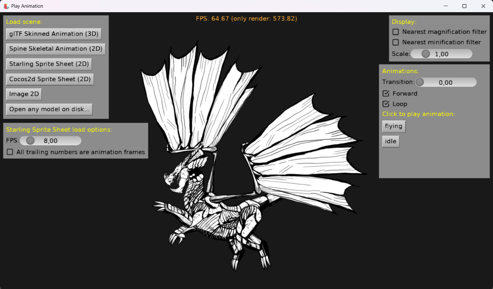

# Play Animation

Demo of playing animations using `TCastleSceneCore.PlayAnimation` method in Castle Game Engine. This is our versatile and most recommended way to play animations. See [Writing code to modify scenes and transformations: Playing animation](https://castle-engine.io/viewport_and_scenes_from_code#_playing_animation).

You can load any 2D or 3D model (sample 2D and 3D models are available), see the detected animations inside, and play them.

You can test various `PlayAnimation` features:

- play forward or backward
- loop or not
- transition (animation blending), see https://castle-engine.io/wp/2018/03/21/animation-blending/ .

Note that view3dscene ( https://castle-engine.io/view3dscene.php ) has "Animations" panel that also allows to test these features.

Using [Castle Game Engine](https://castle-engine.io/).

## Building

Compile by:

- [CGE editor](https://castle-engine.io/editor). Just use menu items _"Compile"_ or _"Compile And Run"_.

- Or use [CGE command-line build tool](https://castle-engine.io/build_tool). Run `castle-engine compile` in this directory.

- Or use [Lazarus](https://www.lazarus-ide.org/). Open in Lazarus `play_animation_standalone.lpi` file and compile / run from Lazarus. Make sure to first register [CGE Lazarus packages](https://castle-engine.io/lazarus).

- Or use [Delphi](https://www.embarcadero.com/products/Delphi). Open in Delphi `play_animation_standalone.dproj` file and compile / run from Delphi. See [CGE and Delphi](https://castle-engine.io/delphi) documentation for details.