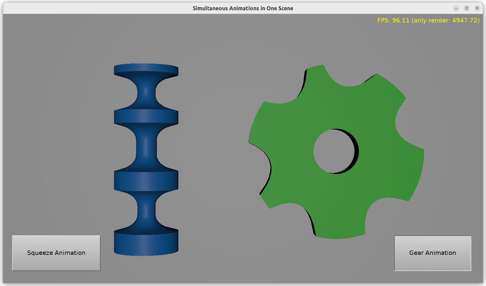

# Playing multiple animations simultaneously

Demo of reading glTF (exported from Blender) file with multiple animations,
each animation affecting different objects in the scene.
You can use `TTimeSensorNode.Start` and `TTimeSensorNode.Stop` to control
these animations separately.

Note that using `TTimeSensorNode.Start` and `TTimeSensorNode.Stop`
is a bit harder than using `TCastleSceneCore.PlayAnimation`
and `TCastleSceneCore.StopAnimation` (and you will miss some `PlayAnimation`
features, like cross-fading between previous and next animation).
But it allows you to independently control multiple animations
within the same `TCastleSceneCore` instance.

Using [Castle Game Engine](https://castle-engine.io/).

## Building

Compile by:

- [CGE editor](https://castle-engine.io/manual_editor.php). Just use menu item _"Compile"_.

- Or use [CGE command-line build tool](https://castle-engine.io/build_tool). Run `castle-engine compile` in this directory.

- Or use [Lazarus](https://www.lazarus-ide.org/). Open in Lazarus `animate_transform_by_code_standalone.lpi` file and compile / run from Lazarus. Make sure to first register [CGE Lazarus packages](https://castle-engine.io/documentation.php).
