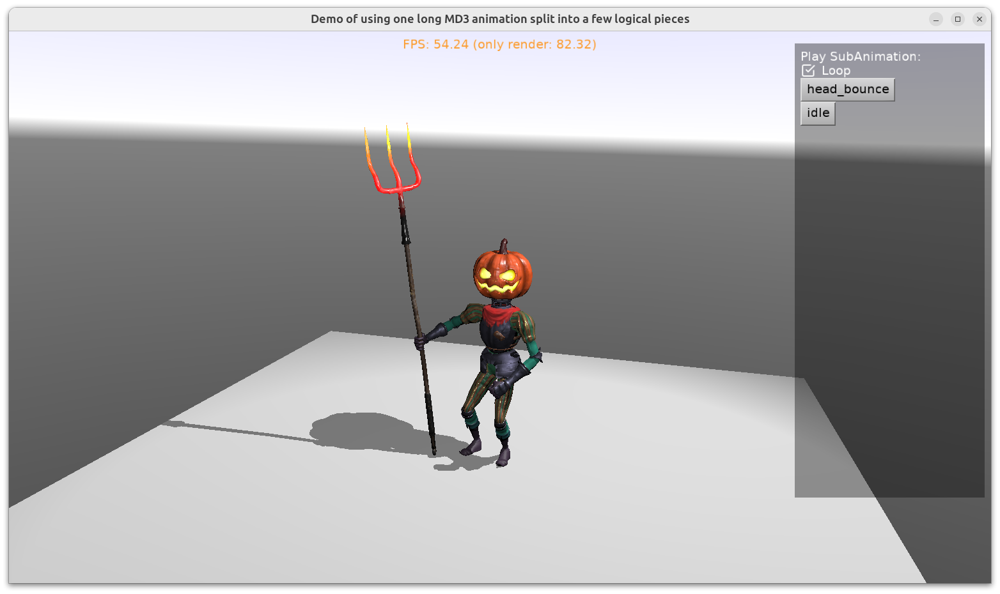

# Split long animation into a number of smaller logical animations (subanimations)

Some 3D models contain one long animation (like `Take 001` which seems to be created by default in _3ds Max_), and the 3D artist relies that you split the long animation into smaller animations (more logical to use) on the game engine side.

This example shows how to do it.

We call the smaller animations "subanimations" in this demo, since they are a subrange of some larger animation.

This example defines `TSubAnimations` behavior class, descendant of `TCastleBehavior`. This behavior can be added to parent `TCastleScene` and play subanimations there:

- Define subanimations using `TSubAnimations.Add`.

- Read information about subanimations by `TSubAnimations.List`.

- Play the subanimation using `TSubAnimations.Play`.

Internally: the playback uses `TCastleSceneCore.ForceAnimationPose` to update each frame. It is done by `TSubAnimations.Update`.

Note: _Castle Game Engine_ API of `TCastleScene` allows you to access the long animation, using `TCastleSceneCore.PlayAnimation`, `TCastleSceneCore.ForceAnimationPose`, `TCastleSceneCore.AnimationsList`. You should not use it directly if you want to use subanimations.

Using [Castle Game Engine](https://castle-engine.io/).

## Building

Compile by:

- [CGE editor](https://castle-engine.io/manual_editor.php). Just use menu item _"Compile"_.

- Or use [CGE command-line build tool](https://castle-engine.io/build_tool). Run `castle-engine compile` in this directory.

- Or use [Lazarus](https://www.lazarus-ide.org/). Open in Lazarus `split_long_animation_standalone.lpi` file and compile / run from Lazarus. Make sure to first register [CGE Lazarus packages](https://castle-engine.io/documentation.php).
