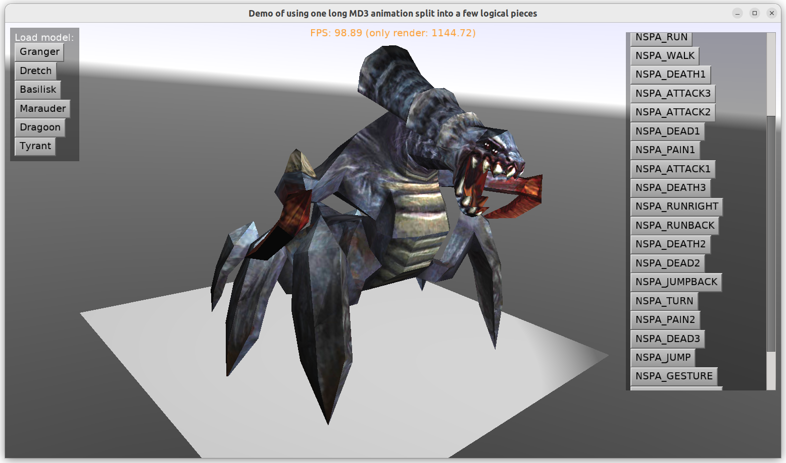

# Demo of using ForceAnimationPose to play a subrange of a larger animation

**TODO: This example is artifical at this point. You don't need to use this code to play MD3 animations. CGE now by default reads `animation.cfg` when loading MD3 file into `TCastleScene`. You can play all MD3 animations using standard `TCastleSceneCore.PlayAnimation` method.**

In case of some 3D authoring software and formats, it happens that we have one, long animation that contains a few logical animations (we call them "subanimations" in this demo) glued together.

To this end, this example defines `TSceneSubAnimations` class, descendant of `TCastleScene`. This class:

- automatically parses `animation.cfg` placed alongside MD3 file when you use `TSceneSubAnimations.Load`

- exposes information about subanimations in `TSceneSubAnimations.SubAnimations`

- allows to play the subanimation using `TSceneSubAnimations.PlaySubAnimation`. Internally the playback uses `TCastleSceneCore.ForceAnimationPose` to update each frame.

This example shows creatures from [Tremulous](https://tremulous.net/), and it assumes that creature has only one long animation called `'animation'` (when loaded to `TCastleScene`). It plays various subranges of this animation.

Using [Castle Game Engine](https://castle-engine.io/).

## Building

Compile by:

- [CGE editor](https://castle-engine.io/manual_editor.php). Just use menu item _"Compile"_.

- Or use [CGE command-line build tool](https://castle-engine.io/build_tool). Run `castle-engine compile` in this directory.

- Or use [Lazarus](https://www.lazarus-ide.org/). Open in Lazarus `split_long_md3_animation_into_logical_pieces_standalone.lpi` file and compile / run from Lazarus. Make sure to first register [CGE Lazarus packages](https://castle-engine.io/documentation.php).
