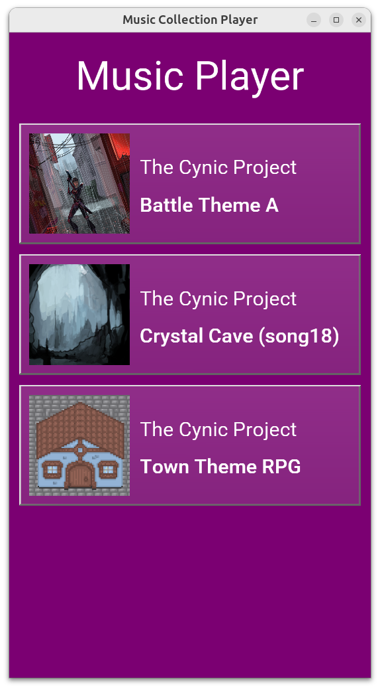
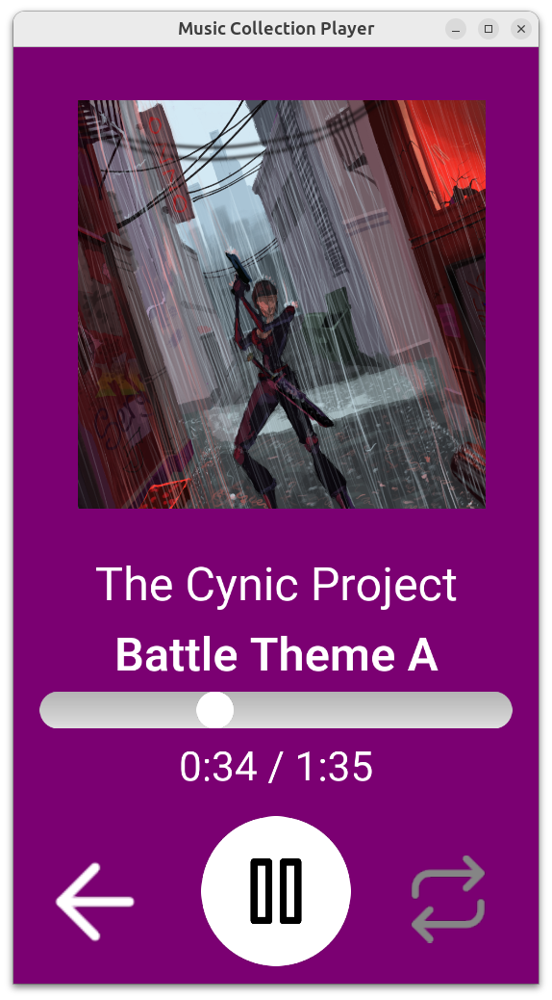

# Music Collection Player

Shows a collection of audio tracks. Each track is an OggVorbis audio file, with an art cover. Allows to play a chosen audio track. The playback resembles popular mobile music players:

- showing the cover,
- position within the track (you can also drag the slider to seek),
- allows to pause / resume the song,
- allows to toggle looping.

Everything works cross-platform, with any sound backend supported by _Castle Game Engine_ (OpenAL, FMOD etc.). The UI is best suited for mobile devices in portrait mode.

This is a starting point to implement a full music player, or audiobook player.

Using [Castle Game Engine](https://castle-engine.io/).

## Screnshots

## Music and art authors

See [data/songs/AUTHORS.md](data/songs/AUTHORS.md) for the list of music and art used in this demo, with links to the original sources and licenses.

## Possible improvements

The music collection is simply hardcoded in the application data. The songs are in `data/songs` directory, and the collection is defined in `GameSongs` initialization in Pascal.

Moreover, there is no concept of "albums" or "artists" here, just a flat list of songs.

Possible ideas for extending this:

- Add albums support, albums group audio tracks.
- Download the list of albums + audio tracks from the Internet, e.g. from a JSON file on your own server. Use `TCastleDownload` to download the JSON file, parse it with `FpJson` (or your own favorite JSON library).
- Download the audio tracks from the Internet, from your own server, instead of having them as hardcoded files in `data/songs`.

## Building

Compile by:

- [CGE editor](https://castle-engine.io/editor). Just use menu items _"Compile"_ or _"Compile And Run"_.

- Or use [CGE command-line build tool](https://castle-engine.io/build_tool). Run `castle-engine compile` in this directory.

- Or use [Lazarus](https://www.lazarus-ide.org/). Open in Lazarus `music_collection_player_standalone.lpi` file and compile / run from Lazarus. Make sure to first register [CGE Lazarus packages](https://castle-engine.io/lazarus).

- Or use [Delphi](https://www.embarcadero.com/products/Delphi). Open in Delphi `music_collection_player_standalone.dproj` file and compile / run from Delphi. See [CGE and Delphi](https://castle-engine.io/delphi) documentation for details.