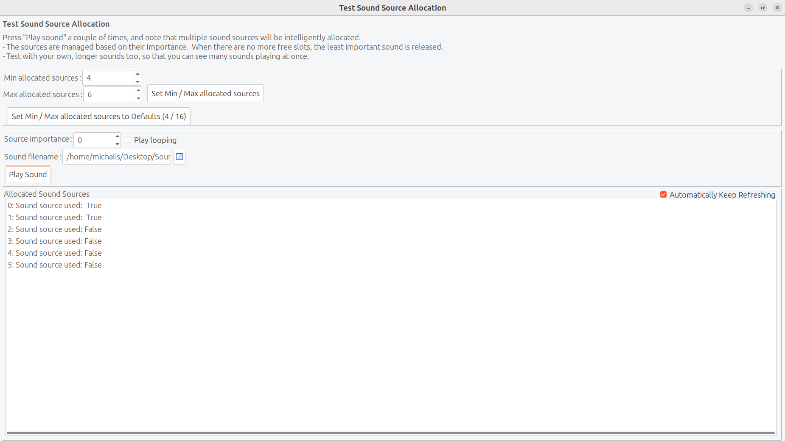

# Test Sound Sources Allocator

Demo showing how does the sound source limit work.

Load any sound (the longer sound, the easier to see the problem) and hit "_Play Sound_" quickly. You will see the sources being allocated in slots (max 6 slots, by default). When all the slots are filled, playing new sound necessarily means that some old sound has to be stopped.

See https://castle-engine.io/sound#limit for description.

Using [Castle Game Engine](https://castle-engine.io/).

## Building

Compile by:

- [Lazarus](https://www.lazarus-ide.org/). Open in Lazarus `test_sound_source_allocator.lpi` file and compile / run from Lazarus. Make sure to first register [CGE Lazarus packages](https://castle-engine.io/lazarus).
