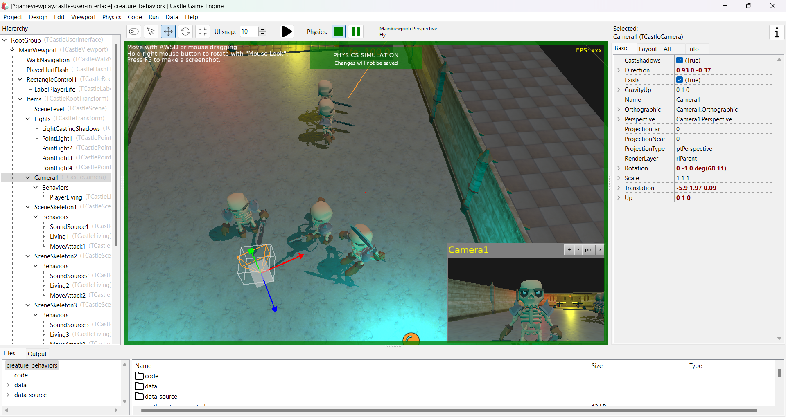

# Testing TCastleBehavior for creatures

Test creature AI implemented by behaviors:

- `TCastleMoveAttack` - move towards the player and attack when close enough.
- `TCastleLiving` - manage life (hit points), for both enemies and player.

See [behaviors](https://castle-engine.io/behaviors) about using behaviors and implementing your own.

Note: This example runs much faster in the _Release_ mode (when optimizations are enabled). In _Debug_ mode, the FPS is noticeably much slower. This is true of all CGE applications, but it's especially noticeable here. See [how to optimize your applications](https://castle-engine.io/manual_optimization.php).

More: [See example of a full game, using TCastleMoveAttack, engine editor, Sketchfab, Blender - demo for "Zlot Delphi 2024"](https://github.com/castle-engine/conference-zlot-delphi-2024). See also [slides from the related presentation (in Polish)](https://castle-engine.io/zlot2024).

## Screenshots

## Building

Using [Castle Game Engine](https://castle-engine.io/).

Compile by:

- [CGE editor](https://castle-engine.io/editor). Just use menu items _"Compile"_ or _"Compile And Run"_.

- Or use [CGE command-line build tool](https://castle-engine.io/build_tool). Run `castle-engine compile` in this directory.

- Or use [Lazarus](https://www.lazarus-ide.org/). Open in Lazarus `creature_behaviors_standalone.lpi` file and compile / run from Lazarus. Make sure to first register [CGE Lazarus packages](https://castle-engine.io/lazarus).

- Or use [Delphi](https://www.embarcadero.com/products/Delphi). Open in Delphi `creature_behaviors_standalone.dproj` file and compile / run from Delphi. See [CGE and Delphi](https://castle-engine.io/delphi) documentation for details.
