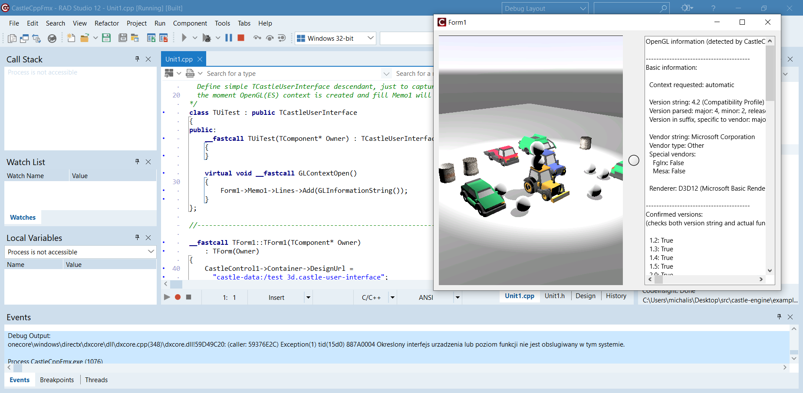

# Using Castle Game Engine with C++ Builder and FMX (FireMonkey)

This example shows using _Castle Game Engine_ API with [C++ Builder](https://www.embarcadero.com/products/cbuilder/) and FireMonkey (FMX).

This allows to write a cross-platform 3D applications using C++ language, and design forms using cross-platform _FireMonkey (FMX)_ components, and use _Castle Game Engine_ to render 3D content inside them.

The full power of _Castle Game Engine_ is available, thanks to the close integration of _C++ Builder_ and _Delphi_. All CGE Pascal classes and just available for C++ code in a natural way, i.e. they are just C++ classes as well. The source code shows loading a CGE design (made by [CGE editor](https://castle-engine.io/editor)) into the `TCastleControl` component, and adding a custom descendant of `TCastleUserInterface` to the form.

## Screenshot

## Building

Make sure to build and install CGE packages first. Make sure to build the packages for all the platforms you want (like _Win32_, _Win64_). See the [Delphi packages installation](https://castle-engine.io/delphi_packages), [Delphi packages documentation](https://github.com/castle-engine/castle-engine/tree/master/packages/delphi) and [TCastleControl documentation](https://castle-engine.io/control_on_form).

Note that for _C++ Builder_ you need to _Build_ the packages **for all your target platforms**. It is not enough to only _Install_ them for Win32 (Delphi IDE architecture) which is enough to allow usage from Delphi / Pascal.

See [C++ Builder documentation](https://castle-engine.io/delphi#cpp_builder) for more details.

Then open this project in _C++ Builder_ and build and run as usual (hit F9).
