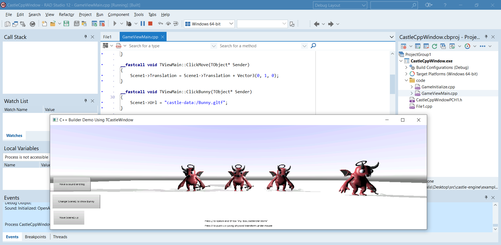

# Using Castle Game Engine with C++ Builder and TCastleWindow

This example shows using _Castle Game Engine_ API with [C++ Builder](https://www.embarcadero.com/products/cbuilder/) and `TCastleWindow`.

This allows to write a cross-platform applications using C++ language, and have a window that is completely rendered using _Castle Game Engine_. This is great if you want to create a complete application using _Castle Game Engine_ for everything, including the window and user interface, and you want to use C++ language.

Just as with the sibling example, `examples/delphi/cpp_builder/fmx`: The full power of _Castle Game Engine_ is available, thanks to the close integration of _C++ Builder_ and _Delphi_. All CGE Pascal classes and just available for C++ code in a natural way, i.e. they are just C++ classes as well.

The source code shows a game designed using [CGE editor](https://castle-engine.io/editor) and using multiple [views](https://castle-engine.io/views). It is quite similar to the `coding` example in Pascal that we presented at the [ITDevCon 2023 conference](https://github.com/castle-engine/conference-itdevcon-2023/), but now it uses C++ for everything.

## Screenshot

## Building

Make sure to build and install CGE packages first. Make sure to build the packages for all the platforms you want (like _Win32_, _Win64_). See the [Delphi packages installation](https://castle-engine.io/delphi_packages), [Delphi packages documentation](https://github.com/castle-engine/castle-engine/tree/master/packages/delphi). Make sure in particular to build `castle_engine_window.bpl` package.

Note that for _C++ Builder_ you need to _Build_ the packages **for all your target platforms**. It is not enough to only _Install_ them for Win32 (Delphi IDE architecture) which is enough to allow usage from Delphi / Pascal.

See [C++ Builder documentation](https://castle-engine.io/delphi#cpp_builder) for more details.

Then open this project in _C++ Builder_ and build and run as usual (hit F9).
