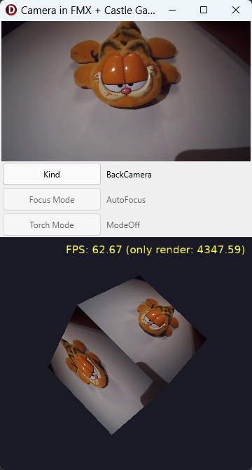

# Camera image, grabbed by FMX (FireMonkey), used as a texture for Castle Game Engine

Demo of using the device camera in an FMX application, with _Castle Game Engine_ rendering on the same form using `TCastleControl`.

- We use [TCameraComponent](https://docwiki.embarcadero.com/Libraries/Florence/en/FMX.Media.TCameraComponent) that provides cross-platform camera support. Tested on Android, iOS and Windows.

- The top of the form shows the camera image using the standard FMX `TImage`.

- We show UI to investigate / change basic camera properties:
    - [Kind (Default, Front, Back)](https://docwiki.embarcadero.com/Libraries/Florence/en/FMX.Media.TCameraComponent.Kind)
    - [Flash Mode (AutoF, Off, On)](https://docwiki.embarcadero.com/Libraries/Florence/en/FMX.Media.TCameraComponent.FlashMode)
    - [Focus Mode (AutoFocus, ContinuousAutoFocus, Locked)](https://docwiki.embarcadero.com/Libraries/Florence/en/FMX.Media.TCameraComponent.FocusMode)
    - [Torch Mode (ModeOff, ModeOn, ModeAuto)](https://docwiki.embarcadero.com/Libraries/Florence/en/FMX.Media.TCameraComponent.TorchMode)

    Not all properties can be changed on all platforms and cameras. The _Flash Mode_ and _Torch Mode_ are disabled when the current camera doesn't have a flash / torch. The _Focus Mode_ is disabled on platforms other than Android and iOS, because FMX doesn't implement it there (e.g. on Windows it is always `AutoFocus`).

- The bottom of the form shows `TCastleControl` with a rotating 3D box. The current camera image is the texture of the box. You can drag to rotate the view (using `TCastleExamineNavigation`).

The camera is accessed using the cross-platform FMX component `TCameraComponent` (unit `FMX.Media`). Each camera frame is an FMX `TBitmap`, we convert it to the engine image using `BitmapToCastleImage` (unit `CastleFmxUtils`) and load it into the texture node (`TImageTextureNode.LoadFromImage`). See the `Unit1.pas` for the code.

This is only useful with Delphi, it relies on FMX and Delphi-specific components.

WARNING: Updating _Castle Game Engine_ texture contents from FMX `TBitmap` may be slow. Unfortunately, there doesn't seem to be an efficient and cross-platform alternative.

Using [Castle Game Engine](https://castle-engine.io/).

## Screenshots

## Permissions

On mobile devices, the application needs a permission to use the camera:

- Android: The permission _"Camera"_ must be enabled in Delphi _"Project -> Options -> Application -> Uses Permissions"_ (for each Android platform you use). The project file already enables it (`AUP_CAMERA` in the DPROJ file), but check it after adding the Android platform.

- iOS: The key `NSCameraUsageDescription` must be present in Delphi _"Project -> Options -> Application -> Version Info"_. Delphi adds it by default, you may want to adjust the text.

At runtime, we ask the user for the permission using `PermissionsService.RequestPermissions` (unit `System.Permissions`) and use the camera only once the permission is granted. This is necessary on Android, where using `TCameraComponent` without the permission raises `EPermissionException`. On iOS, FMX asks for the permission automatically when the camera is activated.

## Building

1. Install Delphi packages following https://castle-engine.io/delphi_packages .

2. Open this project in Delphi and compile + run it from Delphi, as usual Delphi application.

    To run on Android or iOS, add the platform first: in Delphi IDE, right-click on _"Target Platforms"_ and choose _"Add Platform..."_.
