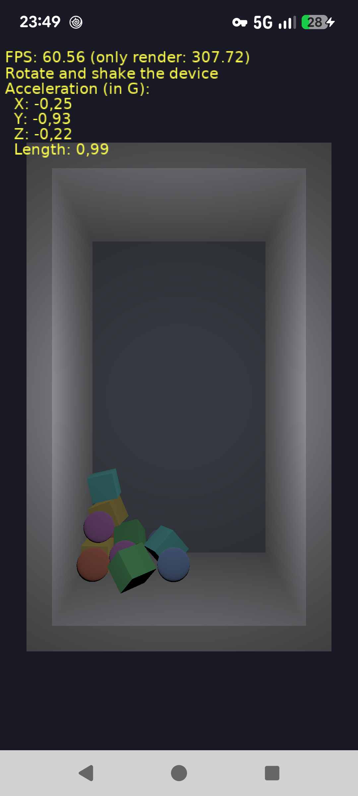

# Accelerometer: real gravity affects 3D objects, in TCastleWindow (Delphi on Android and iOS)

Demo of using the accelerometer (on Android and iOS) in an application using `TCastleWindow`, compiled using Delphi:

- You look into a room with a number of boxes and spheres, that follow the physics.

- The gravity inside this room follows the real gravity, measured by the accelerometer. So the objects always fall "down" in the real world:

    - Hold the device vertically, and they fall to the bottom of the screen.

    - Turn the device upside down, and they fall to the other side.

    - Put the device on the table (screen up), and they fall to the back wall of the room.

- Shake the device to throw the objects around (the accelerometer measures all the acceleration, not only the gravity).

- The label shows the current accelerometer measurements.

- When the accelerometer is not available (e.g. on desktops), use the arrow keys to change the gravity.

The accelerometer is accessed using the cross-platform Delphi component `TMotionSensor` (unit `System.Sensors.Components`). See the `code/gameviewmain.pas` for the code.

Using [Castle Game Engine](https://castle-engine.io/).

The user interface is designed for the portrait orientation, and the application locks the screen orientation to portrait by code (see `FormFactor.Orientations` in `code/gameinitialize.pas`).

Note: Do not use Delphi _"Project -> Options -> Application -> Orientation"_ for this. Delphi IDE implements that option by adding a line to the main program file (DPR), and it fails (with an error that `Application.CreateForm` was not found) because the main program file of an application using `TCastleWindow` doesn't look like a standard FMX program.

## Screenshots

## Building

This example is designed to be compiled only using [Delphi](https://www.embarcadero.com/products/Delphi), as it uses Delphi-specific units to access the device.

Open this project in Delphi (open the `window_accelerometer_standalone.dproj` file) and compile + run it from Delphi, as usual Delphi application.

To run on Android or iOS, add the platform first: in Delphi IDE, right-click on _"Target Platforms"_ and choose _"Add Platform..."_.
