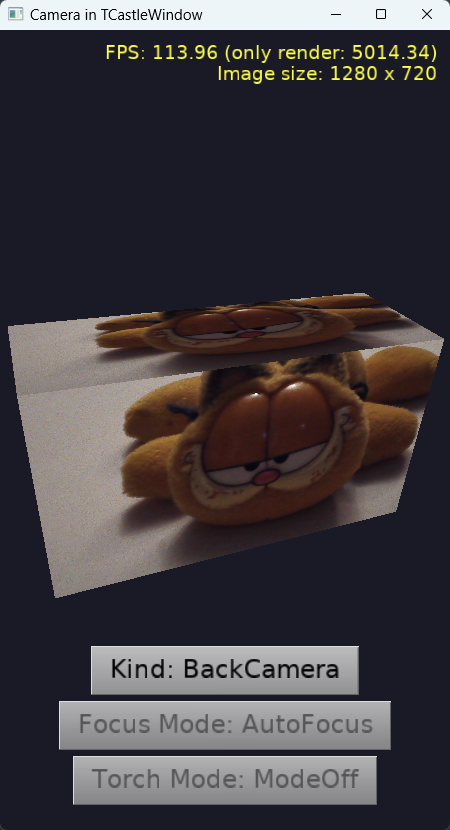
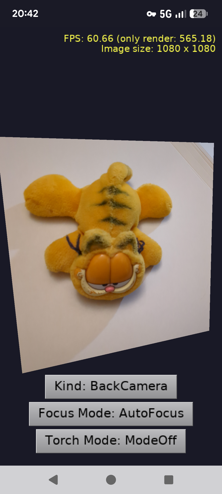
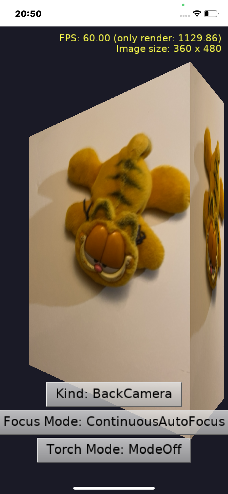

# Camera displayed as a texture in TCastleWindow (Delphi on Android and iOS)

Demo of using the device camera in an application using `TCastleWindow`, compiled using Delphi. Makes sense on all platforms where FMX supports the device camera (tested on Windows, Android, iOS).

- The camera image is displayed full-screen, as a texture on a 3D box (the box swings a bit, to show that it is really 3D).

- We use [TCameraComponent](https://docwiki.embarcadero.com/Libraries/Florence/en/FMX.Media.TCameraComponent) that provides cross-platform camera support.

- The buttons (`TCastleButton`, part of the design in `data/gameviewmain.castle-user-interface`) allow to investigate / change basic camera properties:
    - [Kind (Default, Front, Back)](https://docwiki.embarcadero.com/Libraries/Florence/en/FMX.Media.TCameraComponent.Kind)
    - [Focus Mode (AutoFocus, ContinuousAutoFocus, Locked)](https://docwiki.embarcadero.com/Libraries/Florence/en/FMX.Media.TCameraComponent.FocusMode)
    - [Torch Mode (ModeOff, ModeOn, ModeAuto)](https://docwiki.embarcadero.com/Libraries/Florence/en/FMX.Media.TCameraComponent.TorchMode)

    Not all properties can be changed on all platforms and cameras. The _Torch Mode_ is disabled when the current camera doesn't have a torch. The _Focus Mode_ is disabled on platforms other than Android and iOS, because FMX doesn't implement it there (e.g. on Windows it is always `AutoFocus`).

`TCastleWindow` on Delphi mobile platforms is implemented using FMX, so we can use the cross-platform FMX component `TCameraComponent` (unit `FMX.Media`) to access the camera, even though this application doesn't have any FMX forms designed in Delphi. Each camera frame is an FMX `TBitmap`, we convert it to the engine image using `BitmapToCastleImage` (unit `CastleFmxUtils`) and load it into the texture node (`TImageTextureNode.LoadFromImage`). See the `code/gameviewmain.pas` for the code.

This is only useful with Delphi, it relies on FMX and Delphi-specific components. See also the `examples/delphi/fmx_camera` for a similar example using `TCastleControl` on an FMX form.

Using [Castle Game Engine](https://castle-engine.io/).

The user interface is designed for the portrait orientation, and the application locks the screen orientation to portrait by code (see `FormFactor.Orientations` in `code/gameinitialize.pas`).

Note: Do not use Delphi _"Project -> Options -> Application -> Orientation"_ for this. Delphi IDE implements that option by adding a line to the main program file (DPR), and it fails (with an error that `Application.CreateForm` was not found) because the main program file of an application using `TCastleWindow` doesn't look like a standard FMX program.

## Screenshots

## Permissions

On mobile devices, the application needs a permission to use the camera:

- Android: The permission _"Camera"_ must be enabled in Delphi _"Project -> Options -> Application -> Uses Permissions"_ (for each Android platform you use). The project file already enables it (`AUP_CAMERA` in the DPROJ file), but check it after adding the Android platform.

- iOS: The key `NSCameraUsageDescription` must be present in Delphi _"Project -> Options -> Application -> Version Info"_. Delphi adds it by default, you may want to adjust the text.

At runtime, we ask the user for the permission using `PermissionsService.RequestPermissions` (unit `System.Permissions`) and use the camera only once the permission is granted. This is necessary on Android, where using `TCameraComponent` without the permission raises `EPermissionException`. It also makes proper flow on all other platforms -- on Windows permissions are automatically granted, on iOS the permissions are asked for correctly.

## Building

This example is designed to be compiled only using [Delphi](https://www.embarcadero.com/products/Delphi), as it uses Delphi-specific units to access the device.

Open this project in Delphi (open the `window_camera_standalone.dproj` file) and compile + run it from Delphi, as usual Delphi application.

To run on Android or iOS, add the platform first: in Delphi IDE, right-click on _"Target Platforms"_ and choose _"Add Platform..."_.
