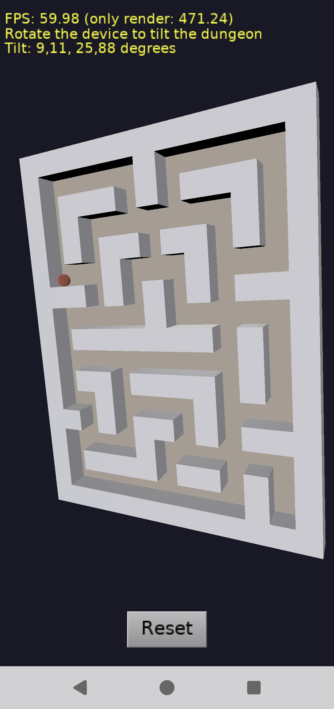

# Gyroscope: tilt a dungeon with a ball, in TCastleWindow (Delphi on Android and iOS)

Demo of using the gyroscope (on Android and iOS) in an application using `TCastleWindow`, compiled using Delphi:

- You see a 3D dungeon (maze) from the top, with a ball inside.

- Rotating (tilting) the device tilts the dungeon. The ball follows the physics, so it rolls "down" inside the tilted dungeon. The dungeon uses a mesh collider (`TCastleMeshCollider`), the ball uses a sphere collider.

- The _"Reset"_ button makes the current device position the "flat" one, and moves the ball back to the initial position.

- When the gyroscope is not available (e.g. on desktops), use the arrow keys to tilt the dungeon.

The gyroscope is accessed using the cross-platform Delphi component `TMotionSensor` (unit `System.Sensors.Components`). See the `code/gameviewmain.pas` for the code.

Some notes about the implementation:

- The gyroscope measures how fast the device rotates. To know the current tilt, we sum the measurements over time. This is simple and reacts immediately, but the errors accumulate. That is one of the reasons for the _"Reset"_ button.

- The code doesn't really rotate the dungeon. A mesh collider is the best choice for a static level, but it cannot be rotated by physics. So we do something that looks exactly the same: we rotate (in the reverse direction) the camera and the gravity direction. See `TViewMain.ApplyTilt`.

- The sensors have differences between platforms: On Android the gyroscope is a separate sensor and reports radians per second. On iOS the gyroscope data is part of the "device motion" sensor and reports degrees per second. The code handles both, see `TViewMain.MotionSensorChoosing`.

The dungeon model in `data/dungeon.x3d` is a simple mesh (floor and walls) generated from a text map.

Using [Castle Game Engine](https://castle-engine.io/).

The user interface is designed for the portrait orientation, and the application locks the screen orientation to portrait by code (see `FormFactor.Orientations` in `code/gameinitialize.pas`).

Note: Do not use Delphi _"Project -> Options -> Application -> Orientation"_ for this. Delphi IDE implements that option by adding a line to the main program file (DPR), and it fails (with an error that `Application.CreateForm` was not found) because the main program file of an application using `TCastleWindow` doesn't look like a standard FMX program.

## Screenshots

## Building

This example is designed to be compiled only using [Delphi](https://www.embarcadero.com/products/Delphi), as it uses Delphi-specific units to access the device.

Open this project in Delphi (open the `window_gyroscope_standalone.dproj` file) and compile + run it from Delphi, as usual Delphi application.

To run on Android or iOS, add the platform first: in Delphi IDE, right-click on _"Target Platforms"_ and choose _"Add Platform..."_.
