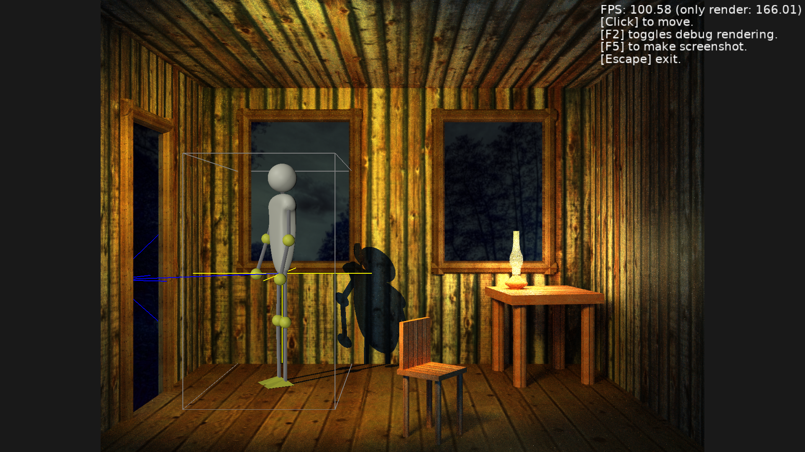

# Fixed-camera demo "The Rift"

## Introduction

This is a demo how to make a game with a fixed (static) camera, and a background drawn as an image, using the Castle Game Engine. The painted background (from a 2D image) is mixed with 3D animated characters that even cast a realistic hard shadows over the scene.

Examples of game using this technique include _"Syberia"_, _"Still Life"_, _"Alone In The Dark"_.

Advantages of this rendering technique:

- The location background is simply a 2D art.

    So if you're a 2D artist, you can create really beautiful backgrounds, depicting fantastic things with incredible detail. You can use any 2D graphic effects from your 2D software (GIMP, Photoshop, etc.). You can use photographs. Or you can render the image with any advanced renderer (global-illumination etc.).

    This allows to show things that would be impossible (or incredibly hard) to accurately model in 3D.

- Since the camera is fixed, you can use this to set nice cinematic camera angles, to visualize (or obscure) what you need.

This technique is very nice for adventure and horror games, where the emphasis is to show a nice view of the location. It's probably not good for shooters, since the aiming is awkward when the camera is still and doesn't match your avatar orientation.

## This is not a finished game

While I planned to make a larger game using this technique, but for now this is only a technological demo, only showing that it's (technically) possible.

- We have a full infrastructure to define locations in XML here, but only a single actual location defined.

- That's also why we have an intro at the beginning, which suggests a game story. The intro itself shows a nice rendering trick.

- The only 3D character is a player, there are no NPCs, for now. Adding NPCs, that are 3D characters and work just like a player, should be easy.

Feel free to be inspired by this and create a full game using this!

## Requirements to make this work

- Each location has a prepared 2D image. Like data/locations/home/renders/render.png .

    It also needs an alternative image showing a fully-shadowed scene version, like data/locations/home/renders/render_shadowed.png . You can make a "shadowed" image by simply darkening the original image.

    When the location casts shadows on itself, these shadows should be already drawn on the image. But this could change, depending on needs.

- Each location also needs a matching 3D model. This model is only rendered to the depth buffer, it is never actually displayed to the player. It only needs to have crude geometry modelled, that needs to receive shadows. Like data/locations/home/scene_final.wrl .

    The 3D location model is used to correctly render the 3D characters.

    - 3D characters must be tested with the depth buffer when rendering, to allow obscuring the 3D characters by a location (like a chair in the foreground, in our demo, that may obscure player's legs).
    - Correctly determine the dynamic shadows from 3D characters.
    - We also need it for collision detection, e.g. to know the 3D point indicated by clicking on location.

    The 3D location model must have a camera (viewpoint in X3D) that precisely matches the 2D images depicting the location.

    The easier way to prepare this is to actually render the image from 3D software, and only later paint on it using a 2D graphic software. This way you automatically get matching 2D images + 3D model. You could also model a 3D scene using an image as a reference -- although this is a little harder.

    Press F2 during the game to actually view the 3D location model, and make sure that it's matching the 2D images.

- The 3D characters cast shadows using shadow volumes. They can freely move and be animated in the scene.

    In the current implementation, this is only used for the player. But you could add NPCs, or other scene parts (like a window shutter moved by the wind), that are 3D.

    Note that to use shadow volumes, your 3D model must be 2-manifold. See https://castle-engine.io/shadow_volumes .

- QUESTION: Should you draw on the location image (render.png in the example above) self-shadows caused by the location geometry?

    For now, yes. This allows to draw these shadows nicely, with some artistic tricks.

    But, depending on your needs, this can be changed. The location 3D scene could also be a shadow caster, just add it to TCastleViewport.RenderShadowVolume .

    This would also allow to make shadow-casting main light dynamic.

    It would also allow the scene to cast shadows over the character. E.g. the chair could cast a shadow over a character behind it.

    It could even be configurable per-location. Or even per-shadow-casting-light, once we implement shadow volumes casting from multiple light sources.

## Building

Compile by:

- [CGE editor](https://castle-engine.io/manual_editor.php). Just use menu item _"Compile"_.

- Or use [CGE command-line build tool](https://castle-engine.io/build_tool). Run `castle-engine compile` in this directory.

- Or use [Lazarus](https://www.lazarus-ide.org/). Open in Lazarus `platformer_standalone.lpi` file and compile / run from Lazarus. Make sure to first register [CGE Lazarus packages](https://castle-engine.io/documentation.php).
