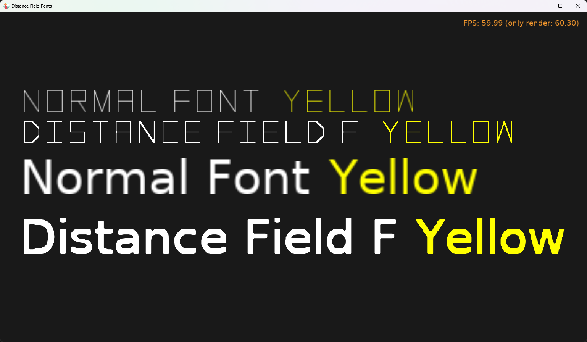

# Distance Field Fonts

Test of _distance field fonts_.

_"Distance field fonts"_ is an alternative font rendering method, that makes glyphs (font characters, like letters) always look "crisp", regardless of the size. They are never "blurry" -- in contrast to the default `TCastleFont` rendering where letters may look blurry if the effective font size is much different from the size for which the internal font texture was prepared (`TCastleFont.OptimalSize`).

For more details how distance field fonts internally work:

- See [this article](https://libgdx.com/wiki/graphics/2d/fonts/distance-field-fonts) (libgdx documentation).

- See [Project 5: Smooth Fonts (aka multi-channel signed distance fonts)](https://github.com/neurolabusc/OpenGLCoreTutorials#project-5-smooth-fonts-aka-multi-channel-signed-distance-fonts) in this repo (Pascal example).

Using [Castle Game Engine](https://castle-engine.io/).

## Building

Compile by:

- [CGE editor](https://castle-engine.io/manual_editor.php). Just use menu item _"Compile"_.

- Or use [CGE command-line build tool](https://castle-engine.io/build_tool). Run `castle-engine compile` in this directory.

- Or use [Lazarus](https://www.lazarus-ide.org/). Open in Lazarus `distance_field_fonts_standalone.lpi` file and compile / run from Lazarus. Make sure to first register [CGE Lazarus packages](https://castle-engine.io/documentation.php).
