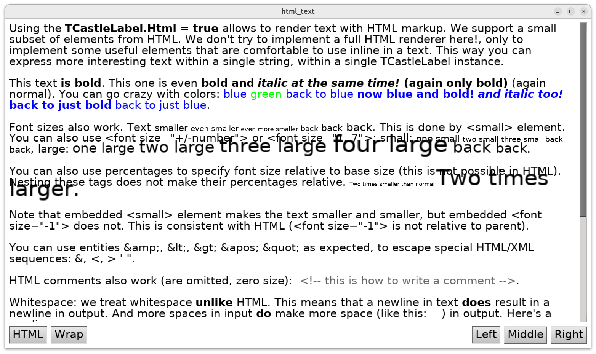

# HTML tags inside TCastleLabel, fonts with bold/italic variants

Showcase using [TCastleLabel.Html](https://castle-engine.io/apidoc/html/CastleControls.TCastleLabel.html#Html) feature, that enabled to use a (small subset of) HTML tags inside the label text. The supported HTML tags are listed at [TCastleAbstractFont.PrintStrings](https://castle-engine.io/apidoc/html/CastleFonts.TCastleAbstractFont.html#PrintStrings-Single-Single-TCastleColor-TStrings-boolean-Single-THorizontalPosition-) docs. They mostly revolve around changing font color, size, and bold/italic variants.

This example also demonstrates setting up [TCastleFontFamily](https://castle-engine.io/apidoc/html/CastleFonts.TCastleFontFamily.html) which makes sense especially when combined with `TCastleLabel.Html`. This allows to define a font with 4 variants (bold or not, italic or not) that can be then used in `TCastleLabel.CustomFont`. The bold/italic variants will be automatically used when HTML text will use tags like `<b>` or `<i>`.

See the [manual about text and fonts](https://castle-engine.io/manual_text.php) for more information.

Using [Castle Game Engine](https://castle-engine.io/).

## Building

Compile by:

- [CGE editor](https://castle-engine.io/editor). Just use menu items _"Compile"_ or _"Compile And Run"_.

- Or use [CGE command-line build tool](https://castle-engine.io/build_tool). Run `castle-engine compile` in this directory.

- Or use [Lazarus](https://www.lazarus-ide.org/). Open in Lazarus `html_text_standalone.lpi` file and compile / run from Lazarus. Make sure to first register [CGE Lazarus packages](https://castle-engine.io/lazarus).

- Or use [Delphi](https://www.embarcadero.com/products/Delphi). Open in Delphi `html_text_standalone.dproj` file and compile / run from Delphi. See [CGE and Delphi](https://castle-engine.io/delphi) documentation for details.
