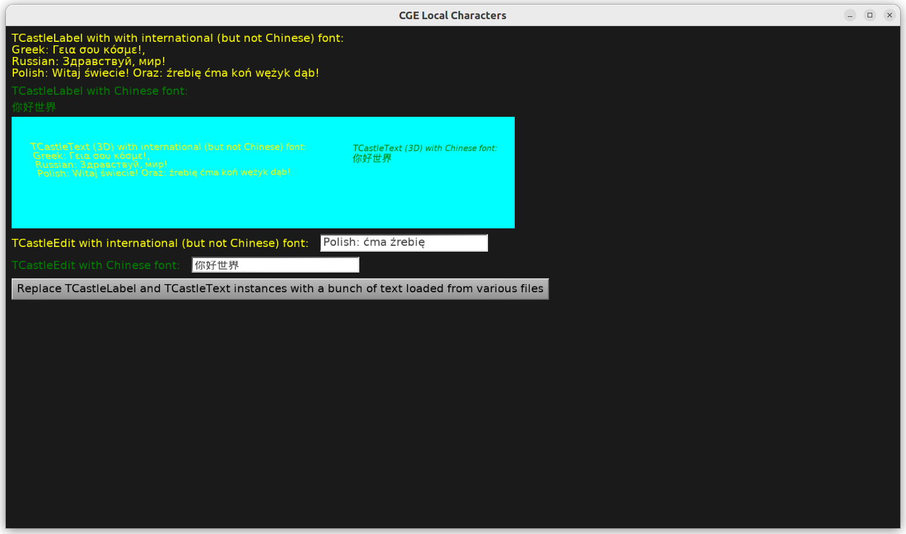

# Display text with various local (Chinese, Greek, Russian, Polish...) characters

Demo that displays strings with various local characters.
Chinese, Greek, Russian sample from https://helloworldcollection.github.io/#Human .

Strings come from various sources (design, XML, hardcoded in Pascal, X3D...).

This shows that internationalization support in Castle Game Engine works nicely.
This demo can also be tested on mobile (Android, iOS).
See https://castle-engine.io/manual_text.php about text and font support in CGE.

Using [Castle Game Engine](https://castle-engine.io/).

## Building

Compile by:

- [CGE editor](https://castle-engine.io/manual_editor.php). Just use menu item _"Compile"_.

- Or use [CGE command-line build tool](https://castle-engine.io/build_tool). Run `castle-engine compile` in this directory.

- Or use [Lazarus](https://www.lazarus-ide.org/). Open in Lazarus `test_local_characters_standalone.lpi` file and compile / run from Lazarus. Make sure to first register [CGE Lazarus packages](https://castle-engine.io/documentation.php).
