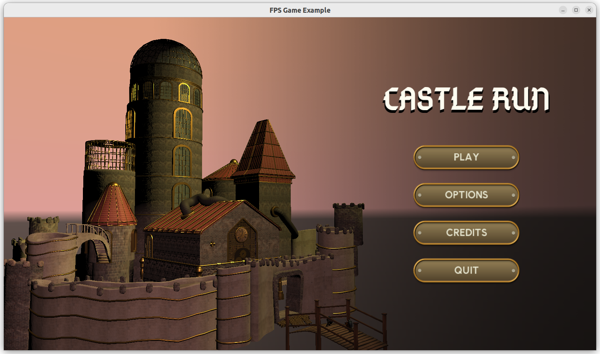

# First-Person Shooter example

**TODO: This example is in the middle of a rework. It not yet fully functional, there's no creature AI, no items pickup, weapon doesn't work. See `examples/deprecated_to_upgrade/fps_game_old_ai/` for a working version but using deprecated API.**

Example of a fully-working 3D FPS game using _Castle Game Engine_.

With level designed using _Castle Game Engine_.

We have:

- level,
- creatures,
- items (medkit and weapon),
- inventory,
- player can be hurt and die,
- player can shoot and kill the creatures,
- bump mapping,
- move limit,
- sectors/waypoints (for AI),
- buttons,
- notifications,
- custom viewport,
- sounds,
- sky,
- water,
- footsteps
- and a *lot* of comments.

## Inputs

Attack (with currently equipped weapon) by clicking with left mouse button.

Move and rotate:

- use AWSD or arrow keys,
- you can activate "Mouse Look" by F4 or holding the right mouse button,
- hold Shift to run.

TODO: Inventory:

- use current item by Enter,
- change current item by [ ] or mouse wheel,
- drop item by R.

Misc:

- screenshot: F5.
- fake win: P,
- fake death: O.

A lot more keys and mouse shortcuts are instantly working
(and they all are configurable, too).

The `MapViewport` in right-bottom part of the screen shows a map view top.
"Examine" view is available and you can zoom in/out using scroll.

## Building

Using [Castle Game Engine](https://castle-engine.io/).

Compile by:

- [CGE editor](https://castle-engine.io/manual_editor.php). Just use menu item _"Compile"_.

- Or use [CGE command-line build tool](https://castle-engine.io/build_tool). Run `castle-engine compile` in this directory.

- Or use [Lazarus](https://www.lazarus-ide.org/). Open in Lazarus `fps_game.lpi` file and compile / run from Lazarus. Make sure to first register [CGE Lazarus packages](https://castle-engine.io/documentation.php).
