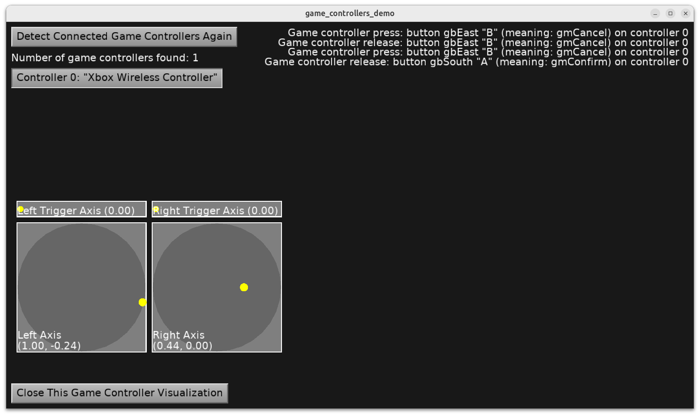

# Game controllers (joysticks, gamepads)

List all avalaible game controlers (joysticks, gamepads).

Test their inputs: axes and buttons.



Using [Castle Game Engine](https://castle-engine.io/).

## Public API for game controllers

See https://castle-engine.io/controllers for the overview of using controllers in your own applications.

This example shows the public API to access game controllers:

- Access them all using the `Controllers` singleton.

- Use `Controllers.Initialize` to initialize the list of available game controllers.

- Receive game controllers button press / release using regular `TCastleUserInterface.Press` / `TCastleUserInterface.Release`. Just like when you handle key and mouse events, see https://castle-engine.io/view_events . Just check for `EventType = itGameController` to detect game controller button events, like this:

    ```delphi
    function TViewMain.Press(const Event: TInputPressRelease): Boolean;
    begin
      Result := inherited;
      if Result then Exit;

      // Handle game controller inputs, when Event.EventType = itGameController.
      // Check Event.Controller.Button and/or Event.Controller.Meaning .

      if (Event.EventType = itGameController) and
         (Event.Controller.Button = gbMenu) then
      begin
        // ... do something
        Exit(true); // handled
      end;

      if (Event.EventType = itGameController) and
         (Event.Controller.Meaning = gmConfirm) then
      begin
        // ... do something
        Exit(true); // handled
      end;
    end;
    ```

- Observe the game controller axis in your view's `Update` method. Look at specific controller properties like

    - `Controllers[0].AxisLeft` (2D axis)
    - `Controllers[0].AxisRight` (2D axis)
    - `Controllers[0].AxisLeftTrigger` (1D axis)
    - `Controllers[1].AxisRightTrigger` (1D axis)

## Building

Compile by:

- [CGE editor](https://castle-engine.io/editor). Just use menu items _"Compile"_ or _"Compile And Run"_.

- Or use [CGE command-line build tool](https://castle-engine.io/build_tool). Run `castle-engine compile` in this directory.

- Or use [Lazarus](https://www.lazarus-ide.org/). Open in Lazarus `game_controllers_demo_standalone.lpi` file and compile / run from Lazarus. Make sure to first register [CGE Lazarus packages](https://castle-engine.io/lazarus).

- Or use [Delphi](https://www.embarcadero.com/products/Delphi). Open in Delphi `game_controllers_demo_standalone.dproj` file and compile / run from Delphi. See [CGE and Delphi](https://castle-engine.io/delphi) documentation for details.
