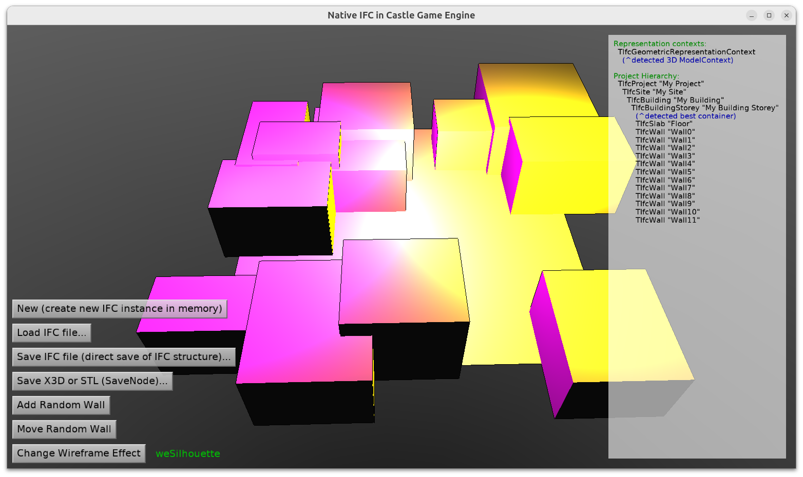

# Native IFC in Castle Game Engine

IFC is a standard 3D model format used in architecture and construction. As a developer, you can:

1. Load and display IFC models using _Castle Game Engine_ [TCastleScene](https://castle-engine.io/apidoc/html/CastleScene.TCastleScene.html) class. For this, follow the general instructions for loading 3D models in the engine, like [manual about viewport with scenes](https://castle-engine.io/viewport_and_scenes).

2. Or you can use API from the [CastleIfc](https://castle-engine.io/apidoc/html/CastleIfc.html) unit for IFC-specific operations.

    This is what this example demonstrates.

    It allows to access (read and write) all the IFC information and operate on it using Pascal classes that directly correspond to the IFC concepts. For example, there's a Pascal class [TIfcWall](https://castle-engine.io/apidoc/html/CastleIfc.TIfcWall.html) that corresponds to the [IFC specification definition of a wall](https://standards.buildingsmart.org/IFC/RELEASE/IFC4_3/HTML/lexical/IfcWall.htm). This example shows how to add a wall to an IFC model, display the change, and save the result to an IFC file.

    The idea is to demonstrate that you can make a a full-featured, IFC-native, 3D editor or analysis tool using _Castle Game Engine_.

    The [documentation about IFC](https://castle-engine.io/ifc) provides more information about the IFC format and how to use it in Castle Game Engine.

## Building

Using [Castle Game Engine](https://castle-engine.io/).

Compile by:

- [CGE editor](https://castle-engine.io/editor). Just use menu items _"Compile"_ or _"Compile And Run"_.

- Or use [CGE command-line build tool](https://castle-engine.io/build_tool). Run `castle-engine compile` in this directory.

- Or use [Lazarus](https://www.lazarus-ide.org/). Open in Lazarus `ifc_standalone.lpi` file and compile / run from Lazarus. Make sure to first register [CGE Lazarus packages](https://castle-engine.io/lazarus).

- Or use [Delphi](https://www.embarcadero.com/products/Delphi). Open in Delphi `ifc_standalone.dproj` file and compile / run from Delphi. See [CGE and Delphi](https://castle-engine.io/delphi) documentation for details.