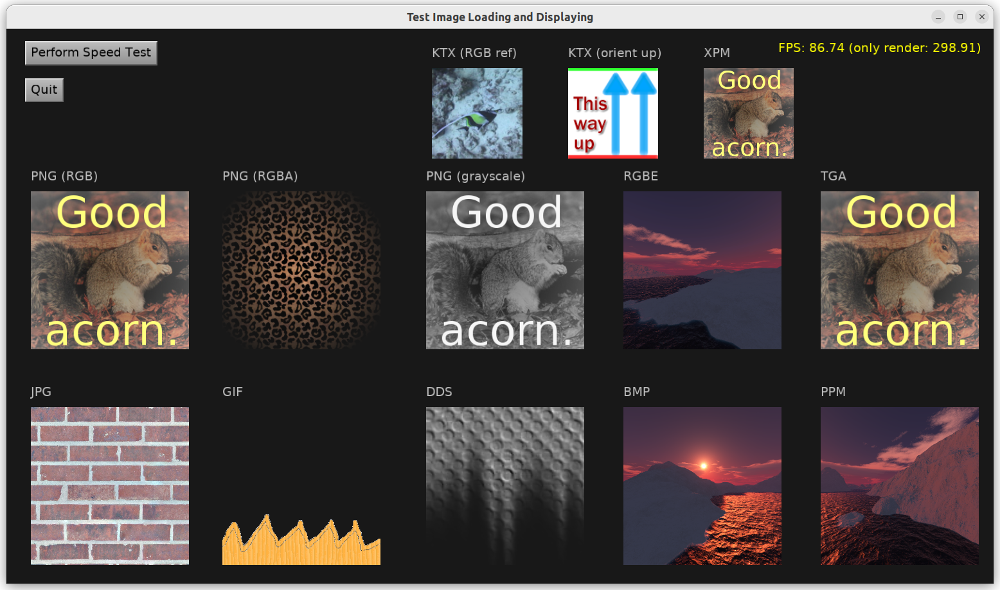

# Test Image Loading and Displaying

Display images in various formats using _Castle Game Engine_ `TCastleImageControl`
(simplest way to display an image as 2D UI element).
Also has a "speed test" functionality.

The purpose of this demo:

- Test that we can load all the required image formats.
- Check speed of loading.
- On all platforms (desktop, mobile), with all compilers (FPC, Delphi).
- Tweak CGE `castleconf.inc` to test various underlying libraries -- e.g. compare speed/features of FpImage, Vampyre Imaging, LIbPng.

Using [Castle Game Engine](https://castle-engine.io/).

## Building

Compile by:

- [CGE editor](https://castle-engine.io/manual_editor.php). Just use menu item _"Compile"_.

- Or use [CGE command-line build tool](https://castle-engine.io/build_tool). Run `castle-engine compile` in this directory.

- Or use [Lazarus](https://www.lazarus-ide.org/). Open in Lazarus `image_display_standalone.lpi` file and compile / run from Lazarus. Make sure to first register [CGE Lazarus packages](https://castle-engine.io/documentation.php).
