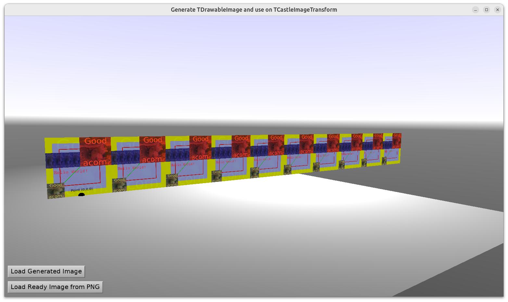

# Generate TDrawableImage and use on TCastleImageTransform

1. Create image contents by drawing on `TDrawableImage`.

    This is our recommended way to create image contents using _Castle Game Engine_ now.

    Contrary to the "old approach" (generating using `TCastleImage` methods), drawing on `TDrawableImage` utilizes GPU, so it's very fast, and feature-rich out-of-the-box. This example shows how to draw other `TDrawableImage` on this `TDrawableImage`, how to draw text and how to draw shapes in the image.

2. Then we use this image as contents for `TCastleImageTransform`, which is our recommended way to display images in a viewport (`TCastleViewport`), both for 2D and 3D games.

    Just to show that it works, our `TCastleImageTransform` has deliberately a few non-standard values, e.g. it has `RepeatImage` set (to dispay the image 10x).

See also https://forum.castle-engine.io/t/how-to-stitch-multiple-images-together/ for some future plans to make this process even more efficient.

Using [Castle Game Engine](https://castle-engine.io/).

## Building

Compile by:

- [CGE editor](https://castle-engine.io/editor). Just use menu items _"Compile"_ or _"Compile And Run"_.

- Or use [CGE command-line build tool](https://castle-engine.io/build_tool). Run `castle-engine compile` in this directory.

- Or use [Lazarus](https://www.lazarus-ide.org/). Open in Lazarus `image_generate_and_use_standalone.lpi` file and compile / run from Lazarus. Make sure to first register [CGE Lazarus packages](https://castle-engine.io/lazarus).

- Or use [Delphi](https://www.embarcadero.com/products/Delphi). Open in Delphi `image_generate_and_use_standalone.dproj` file and compile / run from Delphi. See [CGE and Delphi](https://castle-engine.io/delphi) documentation for details.