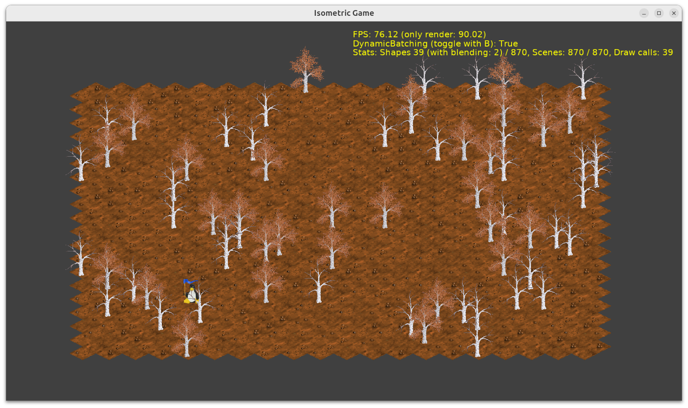

# Isometric Game

Simple example of arranging images in a viewport to show an isometric map layout.

- From code, it creates a random map.

    It creates a number of `TCastleImageTransform` instances and arranges them to show a ground with some trees.

- It includes a pre-designed `TCastleScene` with a sprite sheet and `TCastleImageTransform` with a penguin, just to show that we can also place stuff using the editor in `gameviewmain.castle-user-interface`.

    Animations, sprite sheets, physics... everything can be placed on map this way. See https://castle-engine.io/viewport_and_scenes for documentation what components can be used in a viewport.

- The design contains `TCastle2DNavigation` component so user can easily move (drag with left mouse button) and zoom the map (mouse wheel).

## Notes

- Cross-scene batching when drawing is very important in case of this demo. You need `DynamicBatching` = `true` to have reasonable performance for non-trivial maps.

    Without `DynamicBatching`, this would make 1 "draw call" per image, very inefficient for large maps with 1 or more image per tile. With `DynamicBatching`, images are batched, and the "draw calls" number drops significantly, making them trivial to render.

    Use key `b` to toggle `DynamicBatching` to test this.

## TODO

- Turn this into a real isometric game :)

    - Add a player character moving.

    - Implement "view follows the player" mode, toggable in this demo.

    - Collisions. Player should not be able to move everywhere.

    - Some enemies you can fight with, some NPCs you can talk with, trade with, some items you can pick up...

- Make sure the memory footprint is small. All `TCastleImageTransform` should share the resources, on GPU and CPU. Without the need to wrap them in `TCastleTransformReference`. We have plans to improve the memory footprint of X3D nodes already.

- Add snapping to CGE editor, or even full tile editor inside CGE, to make it easy to design such map in CGE editor.

NOTE: You can also design isometric map using [Tiled](https://www.mapeditor.org/) and load it in CGE using [TCastleTiledMap](https://castle-engine.io/tiled_maps). For examples of using Tiled, see CGE `examples/tiled/` subdirectory. Tiled supports isometric map layout fully.

Using [Castle Game Engine](https://castle-engine.io/).

## Building

Compile by:

- [CGE editor](https://castle-engine.io/manual_editor.php). Just use menu item _"Compile"_.

- Or use [CGE command-line build tool](https://castle-engine.io/build_tool). Run `castle-engine compile` in this directory.

- Or use [Lazarus](https://www.lazarus-ide.org/). Open in Lazarus `isometric_game_standalone.lpi` file and compile / run from Lazarus. Make sure to first register [CGE Lazarus packages](https://castle-engine.io/documentation.php).
