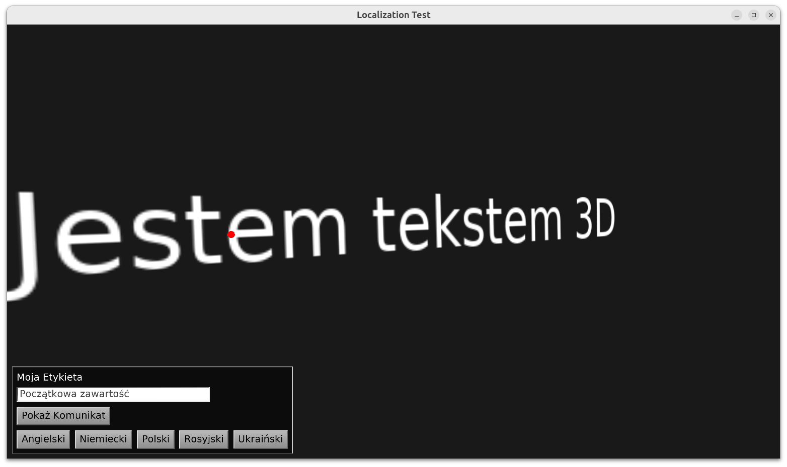

# Localization (translation) demo

Demo how to use localization (translate your game into multiple languages) with Castle Game Engine.

We use `CastleLocalizationGetText` unit, which in turn uses FPC `GetText` unit. See CGE [manual about text and localization](https://castle-engine.io/manual_text.php).



## Creating translations

1. To translate strings used in Pascal code:

    1. Place strings in `resourcestring`. You can use English text in code, or you can use internal translation identifiers (never to be seen by normal users) -- both approaches are possible.

    2. Create initial `game.pot` file (that describes the possible strings to translate).

        _Note that this step is optional_. If you want, you can work without any `game.pot` file, and just create translations by manually creating files like `game.pl.po` for each language. The syntax of PO files is trivial, see `po_files` subdirectory here.

        The `game.pot` can serve a basis for translations. You can create it using strings from the source code:

        * Compile the game (`castle-engine compile`).

        * Use `rstconv` (distributed with FPC) like this: `rstconv -i castle-engine-output/compilation/x86_64-linux/game.rsj -o po_files/game.pot`

        * Note that FPC will create one `xxx.rsj` file for each unit. But this should not limit you. It's normal to put all the strings from the *complete* application into a single `xxx.pot` file. In general, the format of the `.pot` and .po` files (they are the same) is trivial, they are simple text files that can be concatenated together etc.

2. To translate user interface:

    1. Design it using the CGE editor, and write as `xxx.castle-user-interface` files. (More complex scenarios can also be handled using CastleLocalizationGetText utilities, like TranslateDesign.)

    2. Generate the `user_interface.pot` file using `GenerateGetTextPo`. See the trivial utility inside `po_files/generator/po_generator.lpr` in this example.

3. Then translate the PO files.

    * For each `xxxx.pot`, you create a file like `xxxx.ll.po` inserting the 2-latter character code indicating a language.

        You can create the `.po` file from `.pot` just by copying it -- it's the same file format, the `.pot` (PO Template) extension is just a way to indicate _"this is a basis for translation"_.

        Or you can create the `.po` by calling `msginit --locale=pl --input=game.pot --no-translator --output-file=game.pl.po`. This creates `game.pl.po`, with the initial translated strings having contents from `game.pot`. This makes sense if `game.pot` contains English text, and it's a good starting point for a new translation.

    * E.g. you copy `game.pot` to `game.pl.po` to translate to Polish the resourcestrings, and you copy `user_interface.pot` to `user_interface.pl.po` to translate to Polish the user interface designed using the CGE Editor. `pl` stands for a Polish translation, `de` for German, `en` for English etc.

    * Edit the `game.pl.po` using a normal text editor. Or use a specialized editor like https://poedit.net/

    * Note: You cannot force something to be empty by translating it to an empty string. `GetText` treats `msgstr ""` as indicating "not translated", and the `msgfmt` will not even place this mapping in MO file. In turn, the text will be left in the original (English) version. See https://github.com/grosser/gettext_i18n_rails/issues/81 and links from it to other similar issues. To make something empty, for now it's simplest to translate it to a space character.

4. Generate .mo file: `msgfmt po_files/game.pl.po --output-file=data/locale/game.pl.mo`. We have a trivial script here `update_translations.sh` doing that. You need to rerun it after every modification to `po_files`.

## Using translations from Pascal code

* Call in Pascal `CastleTranslateResourceStrings('castle-data:/locale/game.pl.mo');` to use the Polish translation for _resource strings_ (Pascal String constants declared inside `resourcestring`). This simply updates all `resourcestring` contents to the Polish versions.

* Call `TranslateAllDesigns('castle-data:/locale/user_interface.pl.mo');` to translate all user interface to Polish.

* If needed, you can also translate custom things, using more PO files.

    Load them using `LoadGetTextMo` and use the `Translate` method, see FPC docs of [TMOFile](https://www.freepascal.org/docs-html/fcl/gettext/tmofile.html) and the [TMOFile.Translate](https://www.freepascal.org/docs-html/fcl/gettext/tmofile.translate.html) method. Example:

```delphi
var
  Language: String;
  Translations: TCastleMOFile;
begin
  Language := 'pl';
  Translations := LoadGetTextMo('castle-data:/locale/game.' + Language + '.mo');
  Writeln('Translated: ', Translations.Translate('message identifier to translate'));
  FreeAndNil(Translations);
end.
```

## Fonts

Note that we also adjust font in this application.
We load a font with additional German, Polish, Russian and Ukrainian characters.
See the [manual about text and fonts](https://castle-engine.io/manual_text.php).

This is no longer strictly necessary with latest engine [that includes most common Unicode characters in the default font](https://wp.me/p9IgYW-1bL).

## Lazarus references

While we don't use Lazarus LCL code in CGE, but this mechanism is consistent with how Lazarus application can be localized. So a lot of Lazarus documentation apply also to us:

* http://wiki.lazarus.freepascal.org/Step-by-step_instructions_for_creating_multi-language_applications
* http://wiki.lazarus.freepascal.org/Translations_/_i18n_/_localizations_for_programs
* http://wiki.lazarus.freepascal.org/Everything_else_about_translations

See also resources about gettext:

* https://en.wikipedia.org/wiki/Gettext

All the tools and editors for gettext files should work fine.
There are even online services that take a ready PO file for translating.

## Building

Using [Castle Game Engine](https://castle-engine.io/).

Compile by:

- [CGE editor](https://castle-engine.io/editor). Just use menu items _"Compile"_ or _"Compile And Run"_.

- Or use [CGE command-line build tool](https://castle-engine.io/build_tool). Run `castle-engine compile` in this directory.

- Or use [Lazarus](https://www.lazarus-ide.org/). Open in Lazarus `localization_test.lpi` file and compile / run from Lazarus. Make sure to first register [CGE Lazarus packages](https://castle-engine.io/lazarus).
