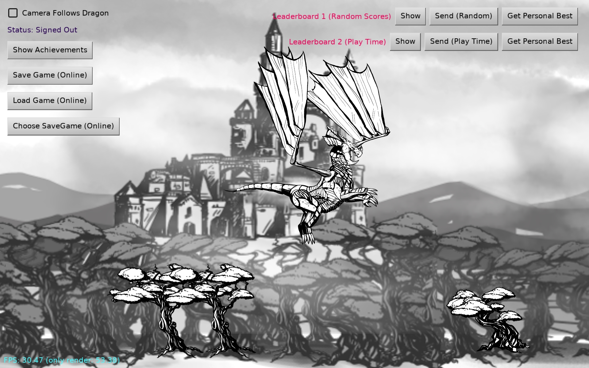

# Game services (achievements, leaderboards, save games...) with Google Play Games and Apple Game Center

Records and shows achievements and leaderboard scores using `CastleGameService`. This uses:

- Google Play Games (on Android)

- Apple Game Center (on iOS)

- On other platforms achievements are ignored now. In the future we may integrate e.g. with Steam achievements, if a Steam service is activated in the project.

The game itself is a simple 2D game with models animated in Spine. It is very similar to the _"New Project -> 2D Game"_ template from the CGE editor, extended only to demonstrate achievements, leaderboards and savegames.

Using [Castle Game Engine](https://castle-engine.io/).

## Building

Compile by:

- [CGE editor](https://castle-engine.io/manual_editor.php). Just use menu item _"Compile"_.

- Or use [CGE command-line build tool](https://castle-engine.io/build_tool). Run `castle-engine compile` in this directory.

- Or use [Lazarus](https://www.lazarus-ide.org/). Open in Lazarus `game_services_demo_standalone.lpi` file and compile / run from Lazarus. Make sure to first register [CGE Lazarus packages](https://castle-engine.io/documentation.php).
