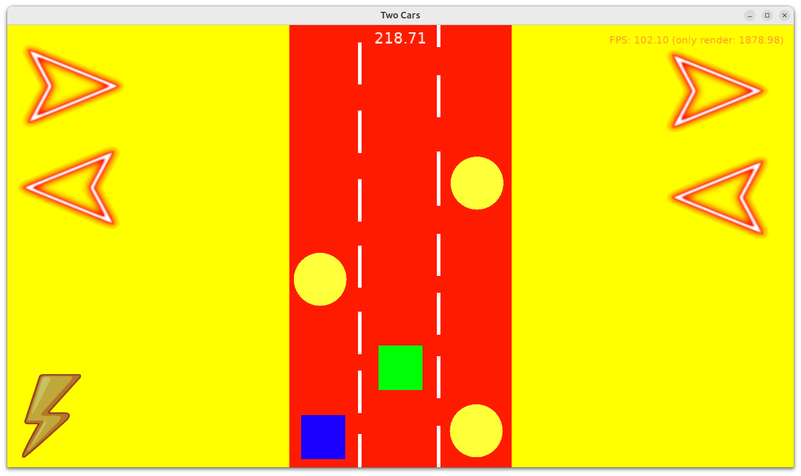
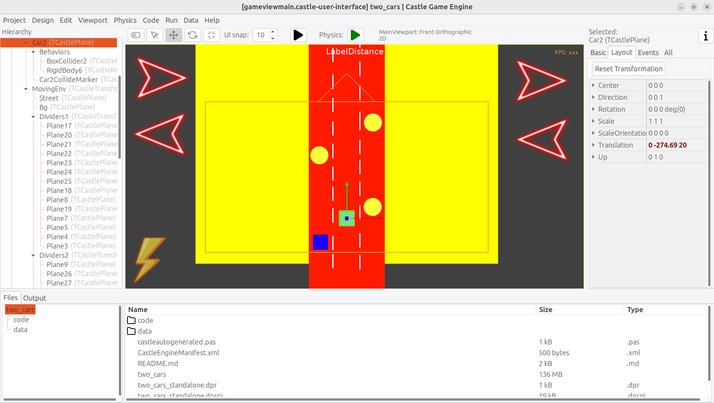

# Two Cars

Simple game with 2 cars, riding forward into infinity, avoiding the obstacles on the road. Deliberately with placeholder graphics and very basic logic -- play with it, extend it, make it into your own toy!

## Features

### Simple top-down 2D view

Graphics in this project are mostly a placeholder (single-color unlit planes and spheres set up in the CGE editor). We mean it, it is rather ugly even for a "programmer art" :)

TODO: Replace them with your real assets (you can find pretty stuff on https://castle-engine.io/assets.php ) and have fun :) Use `TCastleImageTransform` to place images, use `TCastleScene` to place animated sprite sheets, glTF models etc. See [manual about viewport features](https://castle-engine.io/viewport_and_scenes).

### Controls: Move cars

The cars are placed on a street with 3 lanes. There are buttons to change the lane of each car. You can play as 2 people (each person controls one car), or as 1 person (you control both cars).

There's also a button to change the speed, effectively changing the difficulty.

You can also use keyboard: _A_ / _S_ to move car 1, _K_ / _L_ to move car 2, and _Space_ to toggle speed.

TODO: Play around with possible speed values, to make it easier / harder.

### Infinite street

The ride is infinite, we just repeat the same environment (background, street piece, obstacles) into infinity. This is a simple approach to make a game that can be played infinitely. You can design the environment in the editor. You can make it taller, just remember to increase the `MovingEnvSize` constant in the code.

TODO: To have more interesting gameplay, consider randomly spawning the obstacles ahead, instead of repeating the same obstacle pattern each time.

### Obstacles

When colliding with an obstacle, we just play a sound and display additional "collision marker". There's no actual penalty for colliding now.

TODO: Consider adding a penalty (e.g. game over, or subtracting some life) when colliding with an obstacle. Consider making much prettier graphics for car and for collision marker. Consider visualizing some damage (e.g. car becomes red, or smoke starts to come out of it) that accumulates as car collides with obstacles.

### Platforms

The game works on any platform. It has been made specifically to work on mobile, on a tablet, but it's really just a cross-platform toy. The whole input comes down to using 5 buttons and works on any device with a touch screen or mouse or keyboard.

Using [Castle Game Engine](https://castle-engine.io/).

## Screenshots

## Building

Compile by:

- [CGE editor](https://castle-engine.io/editor). Just use menu items _"Compile"_ or _"Compile And Run"_.

- Or use [CGE command-line build tool](https://castle-engine.io/build_tool). Run `castle-engine compile` in this directory.

- Or use [Lazarus](https://www.lazarus-ide.org/). Open in Lazarus `two_cars_standalone.lpi` file and compile / run from Lazarus. Make sure to first register [CGE Lazarus packages](https://castle-engine.io/lazarus).

- Or use [Delphi](https://www.embarcadero.com/products/Delphi). Open in Delphi `two_cars_standalone.dproj` file and compile / run from Delphi. See [CGE and Delphi](https://castle-engine.io/delphi) documentation for details.