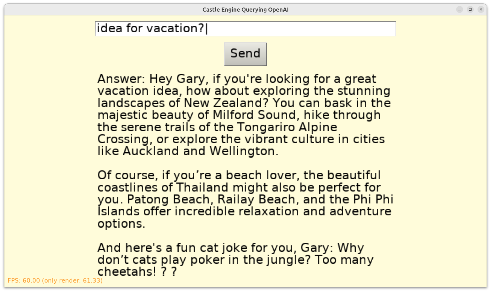

# Castle Game Engine - Ask OpenAI Assistant

Use OpenAI API from _Caste Game Engine_. Ask a question, it gets an answer using OpenAI "assistant".

## Screenshot

Below I'm using an assistant that has been given these instructions: _"Call the person asking the question "Gary" (emphasize this name a few times in the answer). Also, add a cat joke to every answer."_

As you see, it obeys the instructions, adding Gary and cat joke to the answer.



## Platforms

Successfully tested on Windows, Linux and Android with _Castle Game Engine_ with FPC.

It is responsive on all platforms -- utilizing the fact that `TCastleDownload` is asynchronous, it starts a HTTP request and then UI remains responsive.

Should run on all _Castle Game Engine_ platforms where our `TCastleDownload` class (see https://castle-engine.io/multi_player ) has all the necessary capabilities. The `TCastleDownload` is our class for asynchronous HTTP requests.

## How it works and how to compile it

Using OpenAI API terminology, each press of "Send" is doing this:

- Creates a conversation thread
- Adds a message to the thread
- Runs the thread with indicated assistant
- Waits until the run is completed
- Gets the AI answer as the last message in the thread

Before compiling, first create `code/openai_config.inc` file with the following content (you can use `code/openai_config.inc.template` as starting point):

```pascal
{%MainUnit gameviewmain.pas}
OpenAIApiKey = '...';
OpenAIAssistantId = 'asst_...';
```

Fill the above constants with your OpenAI API key and assistant ID. You need to

- have an account on OpenAI,
- create API key ( https://platform.openai.com/api-keys ),
- create an assistant to get the assistant ID ( https://platform.openai.com/assistants , https://platform.openai.com/playground/assistants )
- and have some credits to use the API ( https://platform.openai.com/settings/organization/billing/overview ). This is a paid service -- last time we checked, you need to put at least 5 USD to have some credits.

Using [Castle Game Engine](https://castle-engine.io/).

## Notes about font

We use a default _Castle Game Engine_ font, which has a lot of glyphs but still may miss something, like emoticons that OpenAI likes to return e.g. inside jokes.

When a glyph is missing, we will display `?` instead.

See https://castle-engine.io/text for how to setup a font with more characters.

You can also ask OpenAI assistant to avoid using emoticons.

## OpenAI assistant API

See `test-script/test_openai.sh` for links to OpenAI API documentation and tests.

Note that _Assistants API_ is deprecated now -- we shall migrate to _Responses API_ following https://platform.openai.com/docs/assistants/migration . PRs to do this are welcome. In the meantime, the _Assistants API_ still works.

## Building

Compile by:

- [CGE editor](https://castle-engine.io/editor). Just use menu items _"Compile"_ or _"Compile And Run"_.

- Or use [CGE command-line build tool](https://castle-engine.io/build_tool). Run `castle-engine compile` in this directory.

- Or use [Lazarus](https://www.lazarus-ide.org/). Open in Lazarus `castle_openai_standalone.lpi` file and compile / run from Lazarus. Make sure to first register [CGE Lazarus packages](https://castle-engine.io/lazarus).

- Or use [Delphi](https://www.embarcadero.com/products/Delphi). Open in Delphi `castle_openai_standalone.dproj` file and compile / run from Delphi. See [CGE and Delphi](https://castle-engine.io/delphi) documentation for details.