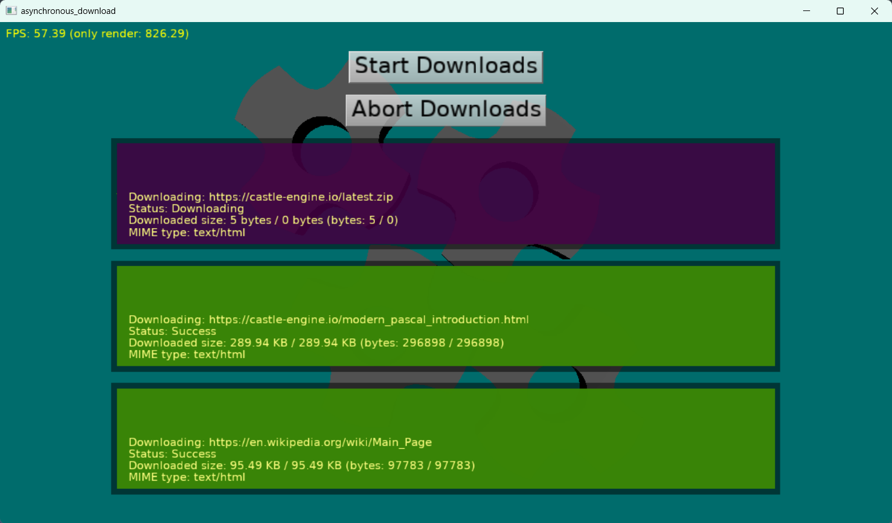

# Asynchronous download

Demonstrates using `TCastleDownload` to download files asynchronously, i.e. without blocking the main application while it waits for the download to finish.

Using [Castle Game Engine](https://castle-engine.io/).

## FPC + HTTPS + Linux

If you use FPC on Linux, note that older FPC (including 3.2.2) does not handle latest OpenSSL library versions.

If you get errors related to OpenSSL, upgrade to latest FPC (from GitLab) e.g. using [fpcupdeluxe](https://castle-engine.io/fpcupdeluxe).

## Building

Compile by:

- [CGE editor](https://castle-engine.io/manual_editor.php). Just use menu item _"Compile"_.

- Or use [CGE command-line build tool](https://castle-engine.io/build_tool). Run `castle-engine compile` in this directory.

- Or use [Lazarus](https://www.lazarus-ide.org/). Open in Lazarus `remote_logging_standalone.lpi` file and compile / run from Lazarus. Make sure to first register [CGE Lazarus packages](https://castle-engine.io/documentation.php).
