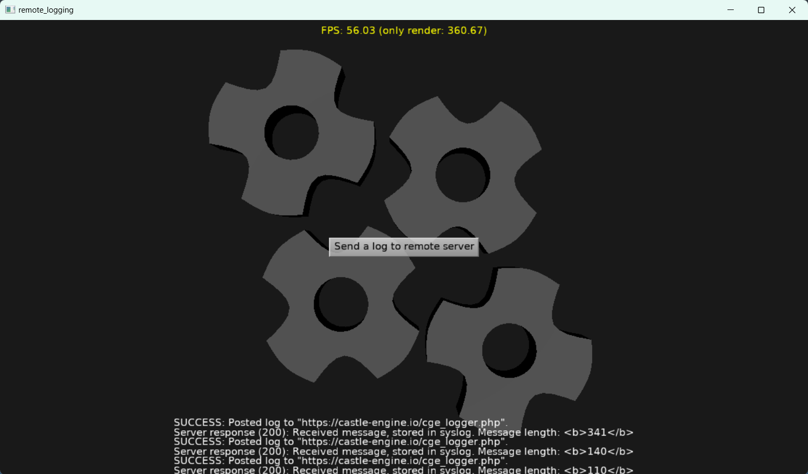

# Send Castle Game Engine log remotely

Demonstrates

- `ApplicationProperties.OnLog`, which allows you to register custom callbacks that receive all log messages.

- Using `TCastleDownload` to send HTTP POST request.

Put together, this demo sends HTTP POST message (to a hardcoded URL https://castle-engine.io/cge_logger.php handled by PHP) on each CGE log message.

In effect, you can view logs remotely.

Usage:

- Just run and press any keys or mouse buttons. They will cause `WritelnLog`, which will be send to your server usign asynchronous HTTP POST.

- Be sure to edit your server name in `gameloghandler.pas`. You need a simplest HTTP server that handles PHP. Use the PHP code from `sample_php_server_logger/cge_logger.php`.

Note that only logs send to CGE CastleLog (like `WritelnLog`, `WritelnWarning`) are captured this way. Other stuff being written e.g. to stdout or stderr is not captured using `ApplicationProperties.OnLog`.

Using [Castle Game Engine](https://castle-engine.io/).

## FPC + HTTPS + Linux

If you use FPC on Linux, note that older FPC (including 3.2.2) does not handle latest OpenSSL library versions.

If you get errors related to OpenSSL, upgrade to latest FPC (from GitLab) e.g. using [fpcupdeluxe](https://castle-engine.io/fpcupdeluxe).

## Building

Compile by:

- [CGE editor](https://castle-engine.io/manual_editor.php). Just use menu item _"Compile"_.

- Or use [CGE command-line build tool](https://castle-engine.io/build_tool). Run `castle-engine compile` in this directory.

- Or use [Lazarus](https://www.lazarus-ide.org/). Open in Lazarus `remote_logging_standalone.lpi` file and compile / run from Lazarus. Make sure to first register [CGE Lazarus packages](https://castle-engine.io/documentation.php).
