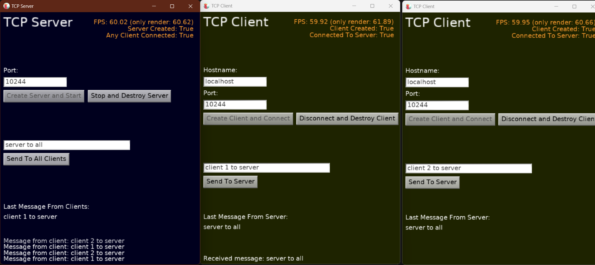
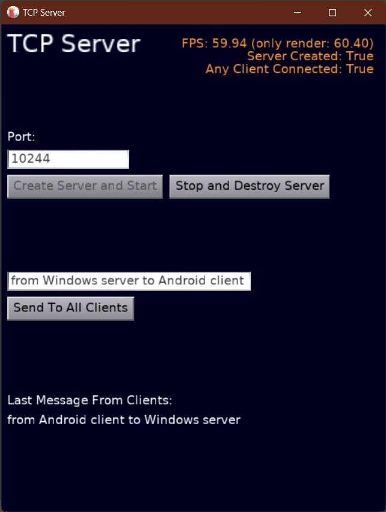
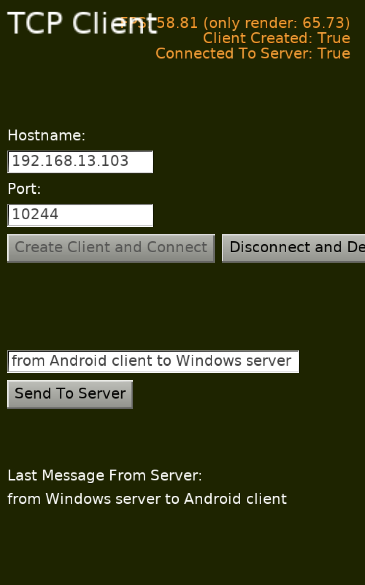

# TCP/IP communication in Castle Game Engine using Indy components

The examples here demonstrate a cross-platform communication using TCP/IP with a "classic" client and server approach. The _Castle Game Engine_ shows the windows and user interface.

## Network Communication

The server and client may be on different computers naturally, just make sure to set the proper host name or IP address in the client so that it can reach the server. The default is `localhost` -- so it works when client and server are on a single computer.

The client and server may be on different systems. For example, server may be on _Android_, and one of the clients on _Windows_ or _Linux_. Or the other way around. We did test various combinations, see screenshots below. All combinations should work.

Remember to enable server access in the firewall, if you have one. Windows automatically asks the whether to allow connections for server, you have to _"Allow"_ them to be able to connect.

## Compiling

* You need [Indy](https://www.indyproject.org/).

    Indy is not distributed with _Castle Game Engine_.

    FPC users: See https://castle-engine.io/manual_network.php#section_indy about installing Indy.

    Delphi users: No need to do anything, Indy is part of Delphi.

* Compiling from Delphi, or using CGE editor with Delphi compiler:

    Should work out-of-the-box. Indy is part of Delphi, there's no need to do any special setup.

* Compiling from Lazarus:

    These examples depend on the `castle_indy` package. Make sure you compile the `packages/castle_indy.lpk` in Lazarus (it depends on Indy package).

* Compiling from CGE editor, with FPC compiler:

    Edit the `client/CastleEngineManifest.xml` and `server/CastleEngineManifest.xml` files and replace the `your/path/to/Indy10` example there with actual path to Indy units on your system. It can be an absolute path (like `c:/indy/` or `/home/me/indy`) or relative path (like `../../indy/`).

## Screenshots

