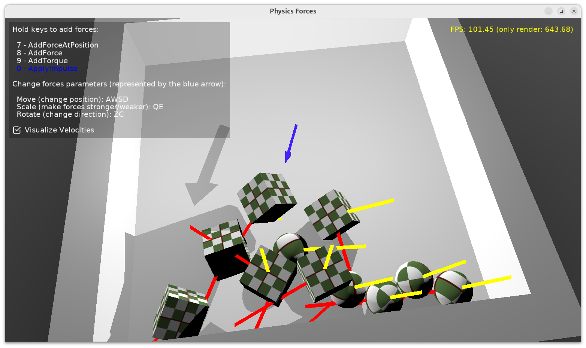

# Physics Forces

Test using `TCastleRigidBody.AddForce` and friends.

A number of rigid bodies are placed in a closed box (because we will hit them with forces and we don't want to escape).

The blue arrow represents the force position, direction, strength.

- Move it by AWSD
- Scale by QE
- Rotate by ZC

Press (you can press once, or hold the key down to keep applying):

- Key 7: `TCastleRigidBody.AddForceAtPosition`
- Key 8: `TCastleRigidBody.AddForce`
- Key 9: `TCastleRigidBody.AddTorque`
- Key 0: `TCastleRigidBody.ApplyImpulse`

The idea is that you can play this weird game with both hands. Left hand controls the arrow (force position/direction), right hand makes given force active.

Using [Castle Game Engine](https://castle-engine.io/).

## Building

Compile by:

- [CGE editor](https://castle-engine.io/editor). Just use menu items _"Compile"_ or _"Compile And Run"_.

- Or use [CGE command-line build tool](https://castle-engine.io/build_tool). Run `castle-engine compile` in this directory.

- Or use [Lazarus](https://www.lazarus-ide.org/). Open in Lazarus `physics_forces_standalone.lpi` file and compile / run from Lazarus. Make sure to first register [CGE Lazarus packages](https://castle-engine.io/lazarus).

- Or use [Delphi](https://www.embarcadero.com/products/Delphi). Open in Delphi `physics_forces_standalone.dproj` file and compile / run from Delphi. See [CGE and Delphi](https://castle-engine.io/delphi) documentation for details.
