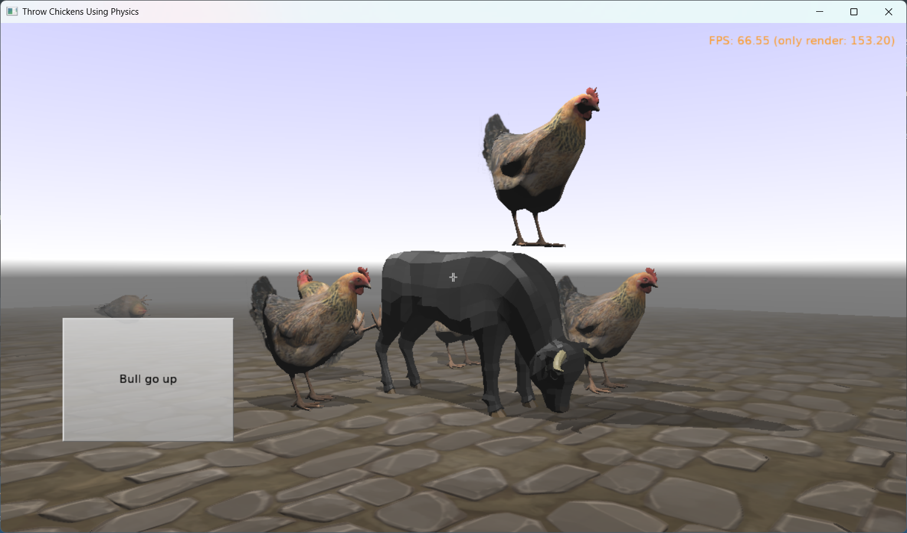

# Funny Demo Throwing Chickens Using Physics

Simple physics demo originally shown at [Delphi Day 2025](https://www.delphiday.it/) conference. See

- [slides from the presentation](https://castle-engine.io/delphiday2025)
- [more info about conferences](https://castle-engine.io/conferences).

This example demonstrates some simple code exercises:

- Throw chickens using physics (press Z or left mouse button).
- Make a log on key press.
- Move 3D object on button press.
- Move 3D object when key is held down.

Using [Castle Game Engine](https://castle-engine.io/).

## Building

Compile by:

- [CGE editor](https://castle-engine.io/editor). Just use menu items _"Compile"_ or _"Compile And Run"_.

- Or use [CGE command-line build tool](https://castle-engine.io/build_tool). Run `castle-engine compile` in this directory.

- Or use [Lazarus](https://www.lazarus-ide.org/). Open in Lazarus `physics_throw_chickens_standalone.lpi` file and compile / run from Lazarus. Make sure to first register [CGE Lazarus packages](https://castle-engine.io/lazarus).

- Or use [Delphi](https://www.embarcadero.com/products/Delphi). Open in Delphi `physics_throw_chickens_standalone.dproj` file and compile / run from Delphi. See [CGE and Delphi](https://castle-engine.io/delphi) documentation for details.