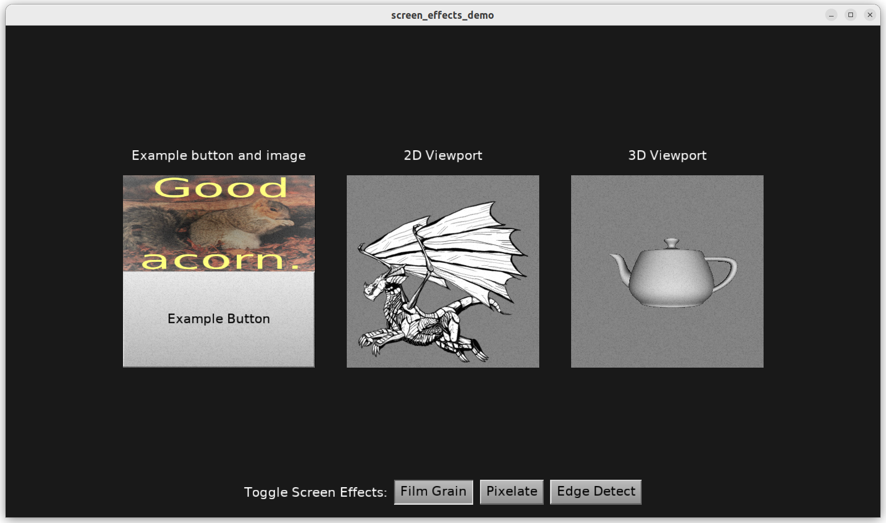

# Screen Effects

Demo of using _screen effects_ (post-processing effects using shaders).

You can use `TCastleScreenEffects` component (or a desdendant of it, `TCastleViewport`) to apply post-processing effects like blur, color effects and more (over anything in CGE - a viewport contents, or any UI). Use the `TCastleScreenEffects.AddScreenEffect` method to add an effect, using an X3D file with an associated definition of shaders and their uniform values (e.g. to pass time, textures to the shader).

See https://castle-engine.io/x3d_extensions_screen_effects.php about our screen effects.

TODO: We want to expose a better API for screen effects in the future. See https://castle-engine.io/roadmap#screen_effects about our plans.

Using [Castle Game Engine](https://castle-engine.io/).

## Building

Compile by:

- [CGE editor](https://castle-engine.io/editor). Just use menu items _"Compile"_ or _"Compile And Run"_.

- Or use [CGE command-line build tool](https://castle-engine.io/build_tool). Run `castle-engine compile` in this directory.

- Or use [Lazarus](https://www.lazarus-ide.org/). Open in Lazarus `screen_effects_demo_standalone.lpi` file and compile / run from Lazarus. Make sure to first register [CGE Lazarus packages](https://castle-engine.io/lazarus).

- Or use [Delphi](https://www.embarcadero.com/products/Delphi). Open in Delphi `screen_effects_demo_standalone.dproj` file and compile / run from Delphi. See [CGE and Delphi](https://castle-engine.io/delphi) documentation for details.
