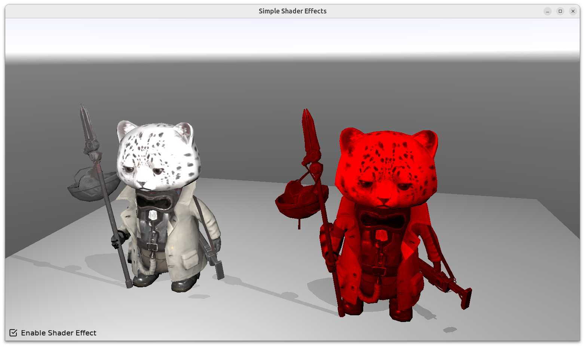

# Simple Shader Effects

Show simple usage of shader effects by

- Creating `TEffectNode` and `TEffectPartNode`
- Referring to GLSL code in `data/shader_color_effect.fs`
- Using `TCastleScene.SetEffects` to apply `TEffectNode` on given scene.

See https://castle-engine.io/shaders for details.

Using [Castle Game Engine](https://castle-engine.io/).

## Building

Compile by:

- [CGE editor](https://castle-engine.io/editor). Just use menu items _"Compile"_ or _"Compile And Run"_.

- Or use [CGE command-line build tool](https://castle-engine.io/build_tool). Run `castle-engine compile` in this directory.

- Or use [Lazarus](https://www.lazarus-ide.org/). Open in Lazarus `shader_effects_simple_standalone.lpi` file and compile / run from Lazarus. Make sure to first register [CGE Lazarus packages](https://castle-engine.io/lazarus).

- Or use [Delphi](https://www.embarcadero.com/products/Delphi). Open in Delphi `shader_effects_simple_standalone.dproj` file and compile / run from Delphi. See [CGE and Delphi](https://castle-engine.io/delphi) documentation for details.