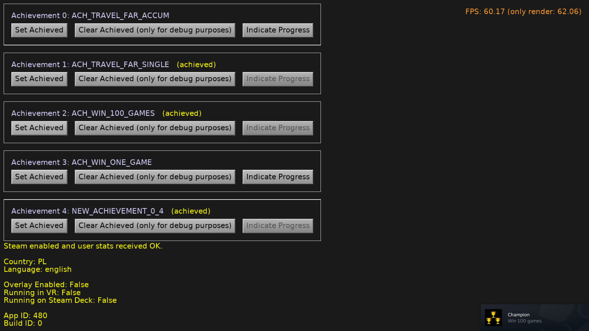

# Steam Test

Test Steam integration with [Castle Game Engine](https://castle-engine.io/). This is a ready application that connects to Steam and allows to report achievements.

Follow the documentation about [Steam and Castle Game Engine](https://castle-engine.io/steam) to set up the Steam dynamic library for this project. If you don't do this, then the integration will do nothing -- the game will still run, but without the Steam dynamic library present we cannot "talk" with Steam.

## Building

Compile by:

- [CGE editor](https://castle-engine.io/manual_editor.php). Just use menu item _"Compile"_.

- Or use [CGE command-line build tool](https://castle-engine.io/build_tool). Run `castle-engine compile` in this directory.

- Or use [Lazarus](https://www.lazarus-ide.org/). Open in Lazarus `SteamTest_standalone.lpi` file and compile / run from Lazarus. Make sure to first register [CGE Lazarus packages](https://castle-engine.io/documentation.php).
