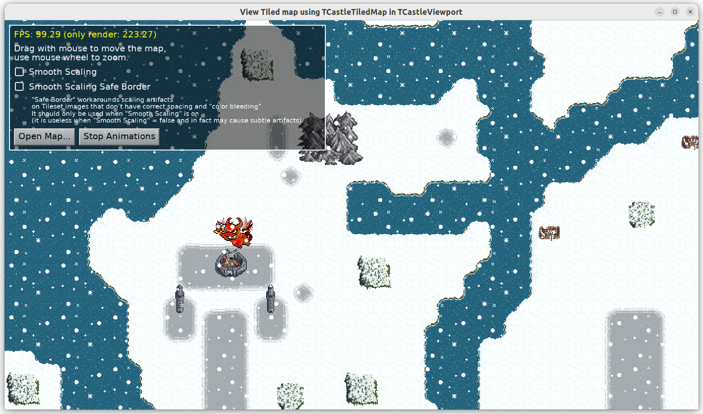

# View Tiled map as TCastleTiledMap in TCastleViewport

Load and view any Tiled map using `TCastleTiledMap` component in `TCastleViewport`.

## Screenshot

## Features

You can

- open any Tiled map (`*.tmx` file),

- pan the map (drag with left mouse button pressed, this is working thanks to standard `TCastle2DNavigation`),

- zoom (use mouse wheel, this is working thanks to standard `TCastle2DNavigation`).

Our `data` subdirectory contains a number of Tiled maps. You can also go ahead and download [Tiled, free map editor](https://www.mapeditor.org/) to edit these maps or create new ones.

Note about using `TCastleTiledMap` in a viewport:

- It works most sensible in orthographic view with camera direction along Z. (This is our default 2D camera.) Otherwise the distance in Z between each layer may be visible.

Using [Castle Game Engine](https://castle-engine.io/).

## Building

Compile by:

- [CGE editor](https://castle-engine.io/editor). Just use menu items _"Compile"_ or _"Compile And Run"_.

- Or use [CGE command-line build tool](https://castle-engine.io/build_tool). Run `castle-engine compile` in this directory.

- Or use [Lazarus](https://www.lazarus-ide.org/). Open in Lazarus `map_viewer_standalone.lpi` file and compile / run from Lazarus. Make sure to first register [CGE Lazarus packages](https://castle-engine.io/lazarus).

- Or use [Delphi](https://www.embarcadero.com/products/Delphi). Open in Delphi `map_viewer_standalone.dproj` file and compile / run from Delphi. See [CGE and Delphi](https://castle-engine.io/delphi) documentation for details.
