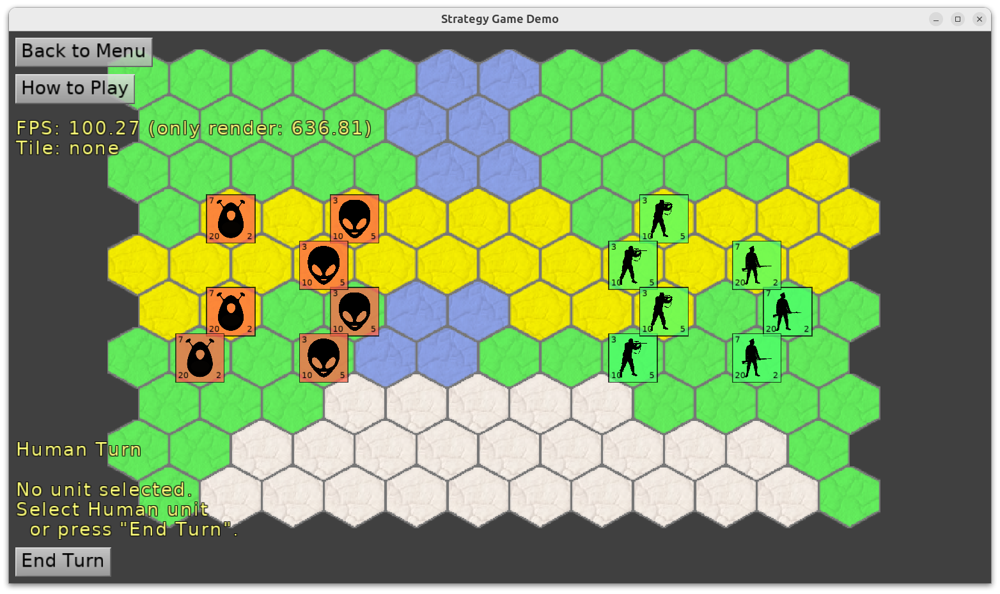

# Strategy Game - turn-based strategy game, with maps designed using Tiled

Demo game using maps designed in Tiled and Castle Game Engine.

All the views (TCastleView descendants) are designed visually
using Castle Game Engine editor.

The actual game logic is mostly inside `GameViewPlay` and `GameUnit` units.

Read [Castle Game Engine documentation about Tiled maps](https://castle-engine.io/tiled_maps) to learn more.

Using [Castle Game Engine](https://castle-engine.io/).

## Building

Compile by:

- [CGE editor](https://castle-engine.io/manual_editor.php). Just use menu item _"Compile"_.

- Or use [CGE command-line build tool](https://castle-engine.io/build_tool). Run `castle-engine compile` in this directory.

- Or use [Lazarus](https://www.lazarus-ide.org/). Open in Lazarus `strategy_game_demo_standalone.lpi` file and compile / run from Lazarus. Make sure to first register [CGE Lazarus packages](https://castle-engine.io/documentation.php).
