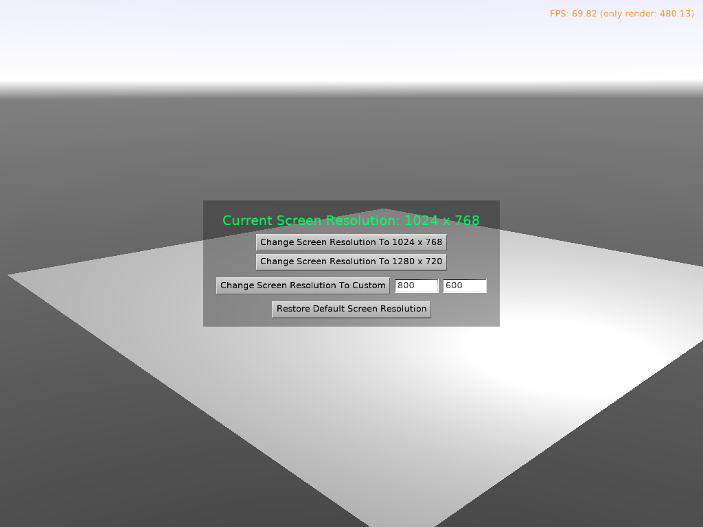

# Test Changing Screen Resolutions

Test changing physical screen resolution using `Application.TryVideoChange`.

This changes actual monitor resolution, and makes sense for full-screen games.

## Warning

Avoid changing the physical screen resolution, in short. Reasons:

- It is not a nice user experience (despite many games offering this feature):

    - _Alt+Tab_ between the game and other applications means that system either needs to change resolutions (delay and blinking when _Alt+Tab_), or shows other applications in non-standard resolution.

    - It is easy to leave system with non-default resolution upon application exit, by mistake. Or when the game crashes.

    - It is up to the monitor how it handles resolutions that are allowed, but do not match the optimal monitor resolution. The display may be stretched non-uniformly or show black borders.

    - Note: [Godot game engine](https://docs.godotengine.org/en/stable/tutorials/rendering/multiple_resolutions.html) has similar notes discouraging changing resolution.

- It is not implemented everywhere in our engine. It is right now implemented only for WinAPI (default Windows backend) and Xlib (non-default Unix backend). It is impossible to ever be implemented on some platforms (like mobile).

    Moreover, we miss something like `EnumerateScreenConfigurations` right now, to show to a user a list of available resolutions that matches user's possible resolution. Note that it would be monitor-specific for multi-monitor setups.

If you want is to easily design a game that works on all possible resolutions then use our UI scaling. This is configurable in `CastleSettings.xml`. See [UI scaling and CastleSettings.xml docs](https://castle-engine.io/manual_castle_settings.php). It doesn't require changing the physical screen resolution, yet allows you to design your game for a particular resolution and it will look good everywhere.

## Building

Using [Castle Game Engine](https://castle-engine.io/).

Compile by:

- [CGE editor](https://castle-engine.io/editor). Just use menu items _"Compile"_ or _"Compile And Run"_.

- Or use [CGE command-line build tool](https://castle-engine.io/build_tool). Run `castle-engine compile` in this directory.

- Or use [Lazarus](https://www.lazarus-ide.org/). Open in Lazarus `screen_resolution_change_standalone.lpi` file and compile / run from Lazarus. Make sure to first register [CGE Lazarus packages](https://castle-engine.io/lazarus).

- Or use [Delphi](https://www.embarcadero.com/products/Delphi). Open in Delphi `screen_resolution_change_standalone.dproj` file and compile / run from Delphi. See [CGE and Delphi](https://castle-engine.io/delphi) documentation for details.