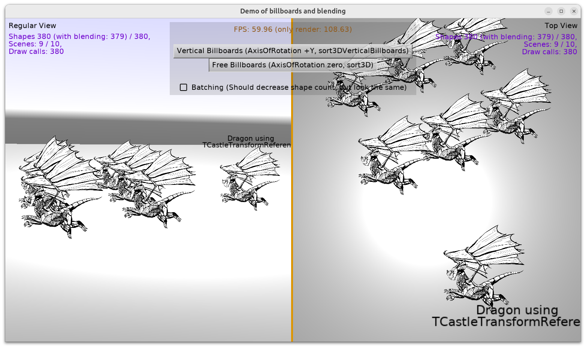

# Demo of billboards and blending

Demo that you can use

- Spine models (or more general: models with very thin layers, that have to be correctly sorted by blending).

- in 3D, with `TCastleBillboard`

- and they will be correctly sorted for blending, i.e. their layers will look OK.

    When `TCastleBillboard` have `TCastleBillboard.AxisORotation` equal zero, then `BlendingSort = sort3D` is good.

    When `TCastleBillboard` have `TCastleBillboard.AxisORotation` all equal +Y, then `BlendingSort = sort3DVerticalBillboards` is good.

- They will also be correctly displayed even when viewed from multiple viewports.

- They will also be correctly displayed using `TCastleTransformReference`.

- They will also be correctly displayed when `TCastleViewport.DynamicBatching` is in effect.

See [API reference](https://castle-engine.io/apidoc/html/) of

- [TCastleBillboard.AxisOfRotation](https://castle-engine.io/apidoc/html/CastleBehaviors.TCastleBillboard.html#AxisOfRotation)
- [TCastleBillboard.MatchCameraDirection](https://castle-engine.io/apidoc/html/CastleBehaviors.TCastleBillboard.html#MatchCameraDirection) (note: `MatchCameraDirection = true` is necessary for blending sorting to work OK)
- [sort3D](https://castle-engine.io/apidoc/html/CastleRenderOptions.html#sort3D)
- [sort3DVerticalBillboards](https://castle-engine.io/apidoc/html/CastleRenderOptions.html#sort3DVerticalBillboards)

Using [Castle Game Engine](https://castle-engine.io/).

## Building

Compile by:

- [CGE editor](https://castle-engine.io/manual_editor.php). Just use menu item _"Compile"_.

- Or use [CGE command-line build tool](https://castle-engine.io/build_tool). Run `castle-engine compile` in this directory.

- Or use [Lazarus](https://www.lazarus-ide.org/). Open in Lazarus `billboards_blending_in_3d_standalone.lpi` file and compile / run from Lazarus. Make sure to first register [CGE Lazarus packages](https://castle-engine.io/documentation.php).
