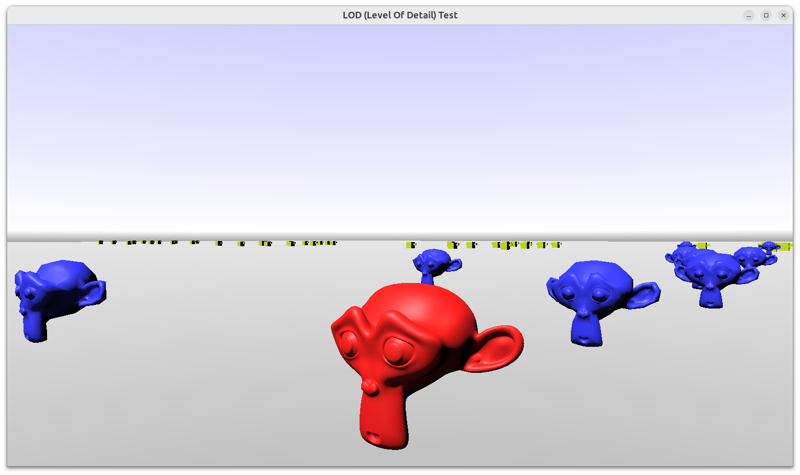

# LOD (Level Of Detail) Test

Simple demo of using _LOD (Level Of Detail)_ with a 3D model.

- Define an X3D file using LOD node like this: [data/monkey_lod.x3dv](data/monkey_lod.x3dv). It can refer to other 3D models that define various versions of the model with different number of polygons. It also defines at which distance each version should be used.

- To use the model with LOD, just load `castle-data:/monkey_lod.x3dv` into a `TCastleScene` instance.

- Be sure to turn on the `TCastleScene.ProcessEvents` to make LOD switching work. Also, it's advised to turn on `TCastleScene.Cache` to speed up loading, if you have many models using the same URL (which in this case, you will most often do).

Using [Castle Game Engine](https://castle-engine.io/).

## Building

Compile by:

- [CGE editor](https://castle-engine.io/editor). Just use menu items _"Compile"_ or _"Compile And Run"_.

- Or use [CGE command-line build tool](https://castle-engine.io/build_tool). Run `castle-engine compile` in this directory.

- Or use [Lazarus](https://www.lazarus-ide.org/). Open in Lazarus `level_of_detail_demo_standalone.lpi` file and compile / run from Lazarus. Make sure to first register [CGE Lazarus packages](https://castle-engine.io/lazarus).

- Or use [Delphi](https://www.embarcadero.com/products/Delphi). Open in Delphi `level_of_detail_demo_standalone.dproj` file and compile / run from Delphi. See [CGE and Delphi](https://castle-engine.io/delphi) documentation for details.