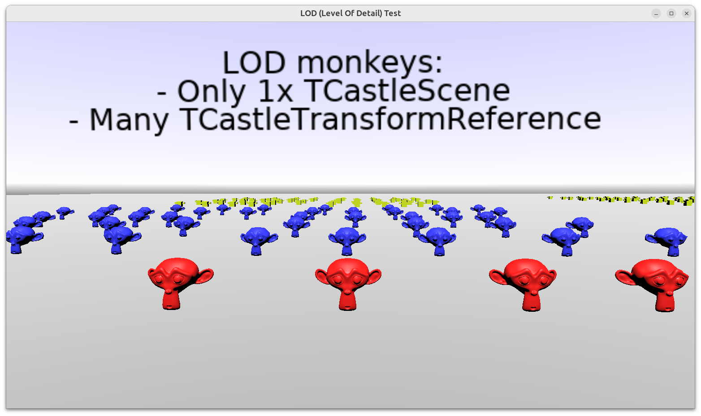
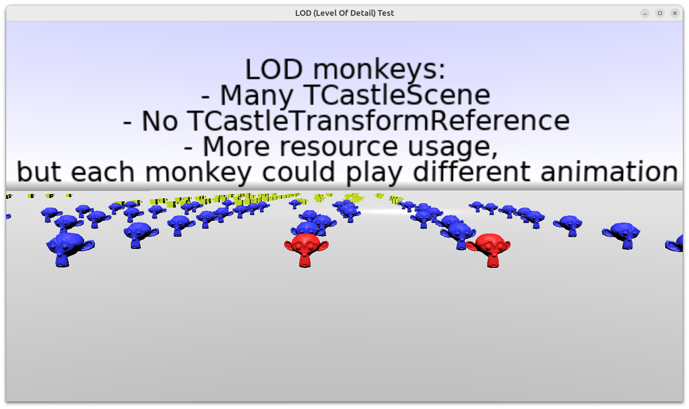
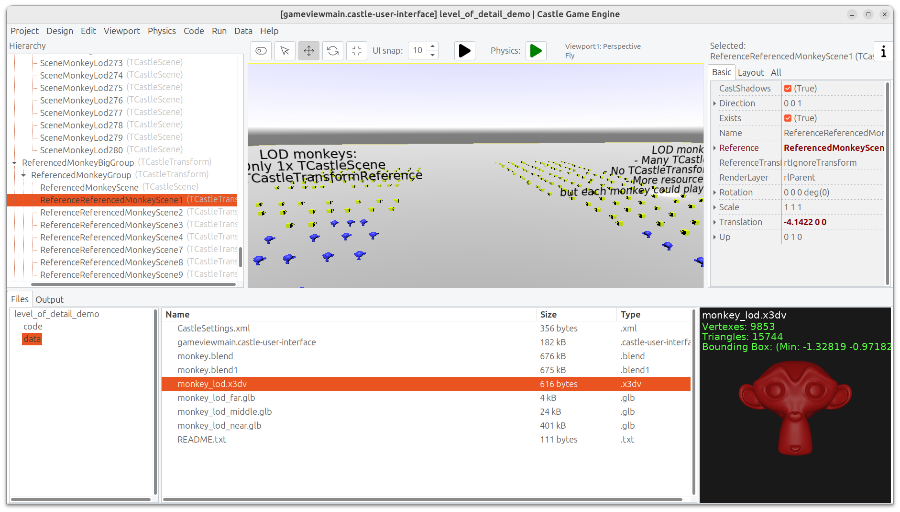

# LOD (Level Of Detail) Test

Simple demo of using _LOD (Level Of Detail)_ with a 3D model.

- Define an X3D file using LOD node like this: [data/monkey_lod.x3dv](data/monkey_lod.x3dv). It can refer to other 3D models that define various versions of the model with different number of polygons. It also defines at which distance each version should be used.

- To use the model with LOD, just load `castle-data:/monkey_lod.x3dv` into a `TCastleScene` instance.

- To display multiple versions of the model ("monkey" in our example), you have 2 options:

    1. If all the monkeys share the same state (e.g. play the same moment of the same animation, or are static) then use _"Duplicate Linked (TCastleTransformReference)"_ that creates multipled references (instances of `TCastleTransformReference`) to a single `TCastleScene` instance.

        This is very memory-efficient, because even if you display million times the same model, you still have only one copy of the model in memory.

        So this is advised, and adequate for this example, when the monkeys don't have any animation at all.

    2. If the instances may need to have a different state (e.g. play a different moment and/or a different animation, e.g. it's a crowd of people) then you should create multiple `TCastleScene` instances. Use the _"Duplicate"_ option in the editor.

        For more efficient loading, turn on `TCastleScene.Cache`. This makes sense if you have many `TCastleScene` instances using the same URL.

Using [Castle Game Engine](https://castle-engine.io/).

## Screenshots

## Building

Compile by:

- [CGE editor](https://castle-engine.io/editor). Just use menu items _"Compile"_ or _"Compile And Run"_.

- Or use [CGE command-line build tool](https://castle-engine.io/build_tool). Run `castle-engine compile` in this directory.

- Or use [Lazarus](https://www.lazarus-ide.org/). Open in Lazarus `level_of_detail_demo_standalone.lpi` file and compile / run from Lazarus. Make sure to first register [CGE Lazarus packages](https://castle-engine.io/lazarus).

- Or use [Delphi](https://www.embarcadero.com/products/Delphi). Open in Delphi `level_of_detail_demo_standalone.dproj` file and compile / run from Delphi. See [CGE and Delphi](https://castle-engine.io/delphi) documentation for details.